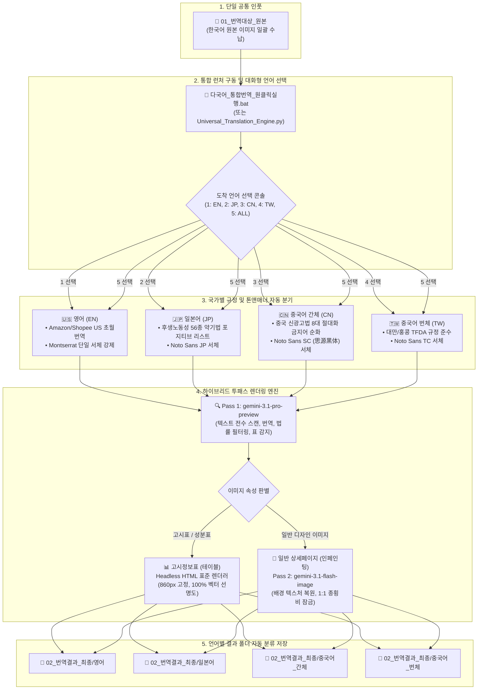

# PANDORA - 다국어 원클릭 텍스트-인-이미지 번역 시스템

한국어 원본 상세페이지/제품 이미지를 단일 공통 폴더에 넣고, 도착 언어(영어, 일본어, 중국어 간체/번체)를 선택하면 각 국가별 법률 및 폰트 규정에 맞추어 원클릭으로 일괄 번역·렌더링하는 통합 시스템입니다.

---

## 📊 워크플로우 차트 다이어그램 (System Architecture)



---

## 🚀 빠른 시작 (원클릭 사용법)

1. **원본 이미지 넣기**:
   - `01_번역대상_원본` 폴더에 번역할 한국어 이미지(`.png`, `.jpg` 등)를 넣습니다.

2. **통합 런처 실행**:
   - `다국어_통합번역_원클릭실행.bat` 파일을 더블클릭하여 실행합니다.
   - (또는 터미널에서 `python Universal_Translation_Engine.py` 실행)

3. **도착 언어 선택 (콘솔 질문에 답변)**:
   ```text
   번역할 도착 언어를 선택하세요:
     [1] 🇺🇸 영어 (EN - Amazon / Shopee US 초월번역 + Montserrat)
     [2] 🇯🇵 일본어 (JP - Qoo10 Japan / 후생노동성 56종 약기법 준수)
     [3] 🇨🇳 중국어 간체 (CN - 중국 본토 신광고법 및 NMPA 규정 준수)
     [4] 🇹🇼 중국어 번체 (TW - 대만/홍콩 TFDA 규정 준수)
     [5] 🌐 전체 언어 일괄 번역 (EN -> JP -> CN -> TW 순차 실행)
     [Q] 종료 (Quit)
   ```
   - 원하는 언어 번호(`1`, `2`, `3`, `4`, `5`)를 입력하고 엔터를 누릅니다.

4. **결과 확인**:
   - 번역이 완료되면 `02_번역결과_최종` 하위의 각 언어별 폴더로 자동 저장됩니다:
     - `02_번역결과_최종/영어`
     - `02_번역결과_최종/일본어`
     - `02_번역결과_최종/중국어_간체`
     - `02_번역결과_최종/중국어_번체`

---

## ⚙️ 엔진 핵심 아키텍처 및 특징

- **Two-Pass 신경망 인페인팅**:
  - **Pass 1 (`gemini-3.1-pro-preview`)**: 텍스트 추출, 마케팅 초월번역, 국가별 광고법/약기법(일본 후생노동성 56종, 중국 신광고법) 자동 필터링.
  - **Pass 2 (`gemini-3.1-flash-image`)**: 배경 보존 및 자연스러운 시각적 텍스트 식자 인페인팅.
- **고시정보표(테이블) 자동 분기**:
  - 제품 고시표/성분표 레이아웃 감지 시 HTML 표준 헤드리스 렌더러로 자동 분기하여 100% 칼같은 선명도 유지.
- **1:1 비율 보존**: 원본 해상도와 종횡비(Aspect Ratio)를 엄격히 동기화.
