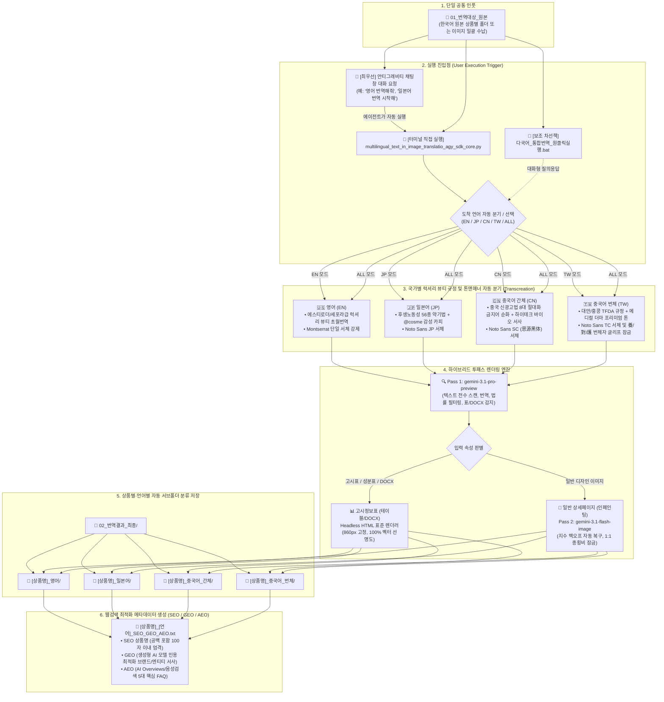

# PANDORA - multilingual_text_in_image_translatio_agy_sdk_core

한국어 원본 상세페이지/제품 이미지를 단일 공통 폴더(`01_번역대상_원본`)에 넣고, 도착 언어(영어, 일본어, 중국어 간체/번체)를 선택하면 각 국가별 법률 및 폰트 규정에 맞추어 원클릭으로 일괄 번역·렌더링하는 통합 시스템입니다.

---

## 📁 서브폴더 독립 아키텍처

- **전용 서브폴더**: [`multilingual_text_in_image_translatio_agy_sdk_core/`](file:///C:/Users/euntaewoo/Desktop/multilingual_text_in_image_translatio_agy_sdk/multilingual_text_in_image_translatio_agy_sdk_core)
- **메인 엔진 스크립트**: [`multilingual_text_in_image_translatio_agy_sdk_core/multilingual_text_in_image_translatio_agy_sdk_core.py`](file:///C:/Users/euntaewoo/Desktop/multilingual_text_in_image_translatio_agy_sdk/multilingual_text_in_image_translatio_agy_sdk_core/multilingual_text_in_image_translatio_agy_sdk_core.py)
- **전용 런처**: [`multilingual_text_in_image_translatio_agy_sdk_core/다국어_통합번역_원클릭실행.bat`](file:///C:/Users/euntaewoo/Desktop/multilingual_text_in_image_translatio_agy_sdk/multilingual_text_in_image_translatio_agy_sdk_core/다국어_통합번역_원클릭실행.bat)

---

## ⚙️ 엔진 하이퍼파라미터 및 토큰 제원 (Hyperparameters & Token Limits)
- **4대 핵심 하이퍼파라미터 (GenerationConfig)**:
  - `temperature`: **0.6** (해외 광고법 준수 안전선 유지 및 럭셔리 초월번역 밸런스 확보)
  - `top_p`: **0.9** (하위 10% 투박한 직역 표현 배제 및 정제된 백화점 뷰티 어휘 필터링)
- **토큰 한도 이원화 및 안전 천장 (Token Limit Dualization & Safety Ceiling)**:
  - **대용량 데이터 추출 및 고시표 번역 (Pass 1 & Table Render)**: `max_output_tokens=8192` (전성분 등 방대한 화학 명칭 및 JSON 구조 유실 방지)
  - **마케팅 카피 및 SEO 생성 (SEO/GEO/AEO)**: `max_output_tokens=8192` (Thinking 토큰 잠식에 의한 Q4/Q5 잘림 방지 안전 천장 확보 + 프롬프트에서 FAQ 5개 및 간결 답변 엄격 제한)
- **HTML 뷰어 소제목 자동 삽입 (Section Heading Auto-Inclusion)**:
  - 섹터 2 및 섹터 3 복사 텍스트/HTML 최상단에 **번역 도착어 공식 소제목(예: `2. Core Value & Active Ingredient Summary`, `3. Product Usage Guide & Frequently Asked Questions (FAQ)`)**을 필수 자동 삽입.
- **4대 마스터 폴더 체계 (4-Master-Folder Lifecycle Lock)**:
  - `01_번역대상_원본` : [신규 인풋] 한국어 원본 상세페이지 이미지 & DOCX 수납
  - `02_번역결과_최종` : [Track 1 신규 아웃풋] 신규 다국어 번역 상세페이지 + SEO + VIEWER 수납
  - `03_번역품질평가` : [Track 2 감사/진단] `01_평가대상_원본` ➔ `02_진단결과` (3초 비렌더링 진단서 발행)
  - `04_번역교정` : [Track 3 교정 완결 아웃풋] 1단계 진단 결함(오타 7종, MoCRA 위반 등)을 100% 교정한 최종 승인본 수납
- **1단계 QA 진단 결과 번역 엔진 2중 강제 주입 (Dual-Layer QA Injection & Deterministic Override)**:
  - `Transcreation_QA_Report.json`의 `correction_feedbacks`(오타 교정표) 및 `transcreation_comparisons`(초월번역 확정 문안)을 Pass 1 프롬프트(`[MANDATORY QA OVERRIDE]`) 및 Python 정규식 필터(`apply_deterministic_qa_overrides`)로 100% 자동 동기화.
- **5단계 QA 최종 재검증 개선 조치 이행 검증 대조표 (Defect Resolution & Delta Checklist)**:
  - 1단계에서 지적된 7대 오타 및 MoCRA 금지어가 최종 렌더링물에 실제로 반영되었는지 `[지적 항목] ➔ [수정 전(Before)] ➔ [권고 교정안] ➔ [최종 결과(After)] ➔ [✅ 정상 반영 판정]` 5대 열로 대조 검증표 렌더링.
- **3대 워크플로우별 결과표 차별화 표준 (3-Track Workflow Table Standards)**:
  - **Track 1 (신규 런칭 - `01` ➔ `02`)**: `💎 3단 순수 초월번역 가치표` (원문 ➔ 확정 초월번역 ➔ 마케팅 가치 분석 / 기계직역 열 완전 배제)
  - **Track 2 (사전 진단 - `03/01` ➔ `03/02`)**: `📊 4단 품질 진단 대조표` (원문 ➔ 실제 기존 타사본 ➔ 초월번역 권고안 ➔ 결함 분석)
  - **Track 3 (교정 재검증 - `03` ➔ `04`)**: `🎯 5단 개선 조치 이행 검증표` (지적 항목 ➔ Before ➔ Target ➔ After ➔ ✅ 정상 반영 판정)

> 💡 **[Temperature 0.6 공학적·수학적 배경 및 실측 제원 주석]**
> - **수학적 작동 원리 (Softmax 연산식)**: $P(w_i) = \frac{\exp(z_i / T)}{\sum_j \exp(z_j / T)}$
>   - $T$ (Temperature)는 다음 단어를 샘플링할 때 확률 분포의 평탄화(Flatness) 정도를 제어하는 조절 매개변수임.
> - **실측 동작 특성 비교**:
>   - `T = 0.5`: 상위 1~2개 고확률 단어에 선택이 집중되어 결정론적/보수적 연산 수행 (문장이 딱딱한 기계 직역으로 고착됨).
>   - `T = 0.7`: 하위 확률 단어의 채택 가능성이 높아져 무작위성 및 창의성은 증가하나, 원문에 없는 과장/절대화 금지어 환각 및 광고법 위반 리스크 급증.
>   - `T = 0.6`: 해외 화장품 광고법(미국 MoCRA, 대만 TFDA, 일본 약기법, 중국 NMPA) 위반 리스크 차단과 백화점·세포라급 럭셔리 초월번역(Transcreation) 감성 품질 간의 **최적 균형점(황금 비율)**.


---

## 📊 워크플로우 차트 다이어그램 (System Architecture)



---

## 🚀 빠른 시작 (사용자 표준 실행법)

### 💬 [방법 1: 최우선] 안티그래비티 창에서 말로 요청하기 (가장 편리)
1. `01_번역대상_원본` 폴더에 번역할 한국어 이미지나 상품별 폴더를 넣습니다.
2. 안티그래비티 채팅창에 아래와 같이 말씀하시면 제가 즉시 번역을 수행하고 품질을 검수하여 보고합니다:
   - *"01_번역대상_원본에 이미지 넣었어, 영어로 번역해줘"*
   - *"일본어 약기법 번역 시작해줘"*
   - *"중국어 간체로 번역해줘"*
   - *"전체 언어로 일괄 번역해줘"*

### 💻 [방법 2] 터미널에서 직접 실행
```bash
.venv\Scripts\python.exe multilingual_text_in_image_translatio_agy_sdk_core\multilingual_text_in_image_translatio_agy_sdk_core.py
```

### 🖱️ [방법 3: 차선책] 탐색기 더블클릭 런처
- `multilingual_text_in_image_translatio_agy_sdk_core\다국어_통합번역_원클릭실행.bat` 더블클릭

---

## 📂 결과물 자동 격리 저장 구조
여러 상품을 작업하더라도 파일이 절대 혼재되지 않도록 **`[최초번역상품명]_[번역국가언어]`** 폴더가 자동으로 생성됩니다:
- `02_번역결과_최종/Professional-Sun-Block-70_영어/`
- `02_번역결과_최종/Professional-Sun-Block-70_일본어/`
- `02_번역결과_최종/Professional-Sun-Block-70_중국어_간체/`
- `02_번역결과_최종/Professional-Sun-Block-70_중국어_번체/`


---

## 🏆 초월번역(Transcreation) 품질 자동 평가 4대 루브릭 (100점 만점)
- **① 현지 카테고리 어휘 적합성 (30점)**: 콩글리시/직역투 배제, 현지 뷰티 플랫폼 네이티브 어휘 채택
- **② 국가별 광고법 무결성 (30점)**: 미국 MoCRA, 일본 약기법, 중국 NMPA/신광고법 위반 표현 100% 차단
- **③ 브랜드 감성 및 초월번역 완성도 (25점)**: 백화점·세포라급 하이엔드 뷰티 톤앤매너 및 구매 전환 설득력
- **④ 시각적 레이아웃 및 가독성 (15점)**: 텍스트 박스 침범 방지 및 간결한 문장 구조
- **[합격 기준 및 자가치유]**: **90점 이상 & 위반 0건 합격**, 미달 시 피드백 기반 **최대 2회 자동 재렌더링 및 `Transcreation_QA_Report.html` 발행**
