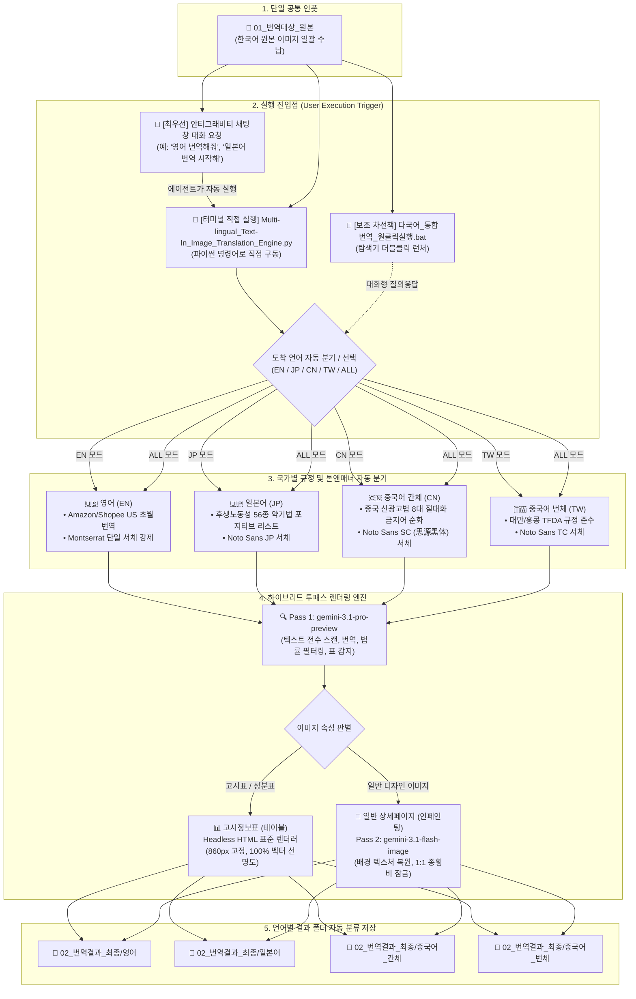

# PANDORA - Multi-lingual_Text-In_Image_Translation_Engine

한국어 원본 상세페이지/제품 이미지를 단일 공통 폴더에 넣고, 도착 언어(영어, 일본어, 중국어 간체/번체)를 선택하면 각 국가별 법률 및 폰트 규정에 맞추어 원클릭으로 일괄 번역·렌더링하는 통합 시스템입니다.

---

## 📊 워크플로우 차트 다이어그램 (System Architecture)



---

## 🚀 빠른 시작 (사용자 표준 실행법)

### 💬 [방법 1: 최우선] 안티그래비티 창에서 말로 요청하기 (가장 편리)
1. `01_번역대상_원본` 폴더에 번역할 한국어 이미지를 넣습니다.
2. 안티그래비티 채팅창에 아래와 같이 말씀하시면 제가 즉시 번역을 수행하고 품질을 검수하여 보고합니다:
   - *"01_번역대상_원본에 이미지 넣었어, 영어로 번역해줘"*
   - *"일본어 약기법 번역 시작해줘"*
   - *"중국어 간체로 번역해줘"*
   - *"전체 언어로 일괄 번역해줘"*

### 💻 [방법 2] 터미널에서 직접 실행
- **대화형 선택 모드**:
  ```bash
  .venv\Scripts\python.exe Multi-lingual_Text-In_Image_Translation_Engine.py
  ```
- **특정 언어 즉시 실행 모드**:
  ```bash
  .venv\Scripts\python.exe Multi-lingual_Text-In_Image_Translation_Engine.py --lang EN   # 영어
  .venv\Scripts\python.exe Multi-lingual_Text-In_Image_Translation_Engine.py --lang JP   # 일본어
  .venv\Scripts\python.exe Multi-lingual_Text-In_Image_Translation_Engine.py --lang CN   # 중국어 간체
  .venv\Scripts\python.exe Multi-lingual_Text-In_Image_Translation_Engine.py --lang TW   # 중국어 번체
  .venv\Scripts\python.exe Multi-lingual_Text-In_Image_Translation_Engine.py --lang ALL  # 전체 일괄
  ```

### 🖱️ [방법 3: 차선책] 탐색기 더블클릭 런처
- `다국어_통합번역_원클릭실행.bat` 더블클릭 ➔ 콘솔에서 숫자(1~5) 입력

---

## ⚙️ 엔진 핵심 아키텍처 및 특징

- **Two-Pass 신경망 인페인팅**:
  - **Pass 1 (`gemini-3.1-pro-preview`)**: 텍스트 추출, 마케팅 초월번역, 국가별 광고법/약기법(일본 후생노동성 56종, 중국 신광고법) 자동 필터링.
  - **Pass 2 (`gemini-3.1-flash-image`)**: 배경 보존 및 자연스러운 시각적 텍스트 식자 인페인팅.
- **고시정보표(테이블) 자동 분기**:
  - 제품 고시표/성분표 레이아웃 감지 시 HTML 표준 헤드리스 렌더러로 자동 분기하여 100% 칼같은 선명도 유지.
- **1:1 비율 보존**: 원본 해상도와 종횡비(Aspect Ratio)를 엄격히 동기화.
