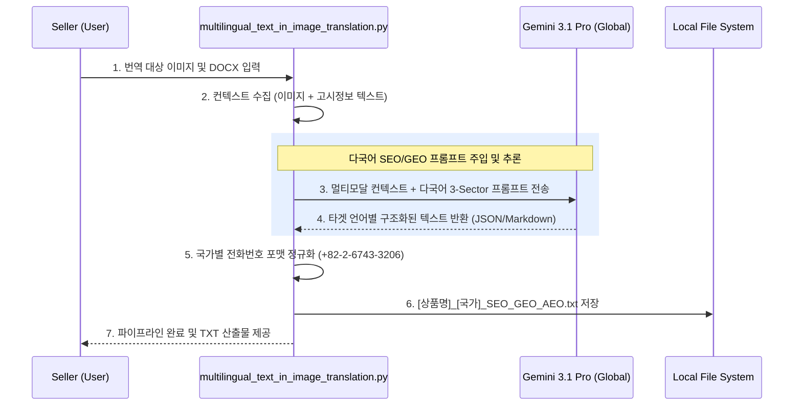

# 글로벌 크로스보더 SEO/GEO/AEO 다국어 자동 생성 파이프라인 설계서

> **작성일**: 2026-08-20  
> **목적**: 상품 상세페이지(PDP) 인페인팅 렌더링 후, 이커머스 상품 관리자(Seller Center) 등록용 검색 최적화(SEO/GEO/AEO) 텍스트를 다국어(영어, 중국어, 일본어 등)로 자동 생성하는 시스템의 아키텍처 및 템플릿 표준 정의서. 향후 에이전트 및 개발자가 재사용 및 유지보수 시 본 문서를 기준으로 구동 원리를 파악함.

---

## 1. 아키텍처 개요 및 구동 엔진

- **핵심 엔진**: `gemini-3.1-pro-preview` (멀티모달 추론 전용)
- **리전 강제**: `location="global"` (Serverless 관리형 규격, 구글 공식 가이드 준수)
- **주요 기능**:
  - 원본 상품 이미지(멀티모달 분석)와 상품 고시정보(DOCX 메타데이터)를 융합하여 상품의 성분, 효능, 특장점을 스스로 파악.
  - 최신 검색 엔진 및 생성형 AI 검색(GEO: Generative Engine Optimization)에 최적화된 **구조화된 데이터 포맷(Structured Data)**으로 텍스트를 자동 작성.
  - 이커머스 입점 시(아마존, 큐텐, 쇼피 등) 복사-붙여넣기만 하면 되도록 불필요한 서술형 문장을 배제하고 **Micro-Summary** 포맷 강제.

---

## 2. 워크플로우 다이어그램 (System Flow)

---

## 3. 핵심 출력 스펙 : 3-Sector 마이크로-써머리 표준 포맷

과거의 장황한 산문형 방식에서 탈피하여, **모바일 가독성 향상 및 AI/검색 스파이더의 엔티티 파싱 효율 극대화**를 위해 아래와 같은 3단계 초간결 구조(Ultra-Compact Micro-Summary)를 100% 강제합니다. (모든 소제목은 타겟 국가의 언어로 번역되어 출력됨)

### Sector 1. 공식 글로벌 이커머스 상품 타이틀 (Official E-Commerce Product Title)
- **제약 사항**: 공백 포함 100자 이내 엄수.
- **표준 공식**: `[브랜드명] + [핵심 특허/성분] + [상품 정규명] + [핵심 효능] + [용량]`
- **특징**: 내부 개발자 용어("Generative AI Search" 등) 배제. B2C 고객 지향적 타이틀 노출.

### Sector 2. 핵심 가치 및 성분 마이크로-써머리 (Core Value & Active Ingredient Summary)
- **제약 사항**: 서술형 문장/단락 절대 금지. 5줄 이내의 단답형 키워드 리스트 강제.
- **포맷 구조 (Key-Value 매핑)**:
  - **Brand**: (1줄 철학)
  - **Core Ingredients**: (콤마 구분된 3~4개 핵심 성분)
  - **Key Benefits**: (콤마 구분된 3~4개 핵심 효능)
  - **Formulation**: (콤마 구분된 2~3개 제형/배합 특징)
  - **Search Tags**: (SEO 노출용 10대 해시태그/검색어)

### Sector 3. 사용 가이드 및 소비자 FAQ (Product Usage Guide & FAQ)
- **제약 사항**: 이커머스에서 가장 많이 묻는 5대 질문(효능, 사용법, 민감성, 성분 시너지, 보관/CS)에 대한 상세하고 친절한 답변 제공.
- **특징**: 고객센터 번호(`+82-2-6743-3206`) 필수 포함 규정 강제 적용.

---

## 4. 프롬프트 엔지니어링 재사용 가이드 (Maintainer Guide)
- 파이프라인 프롬프트를 수정할 경우 `multilingual_text_in_image_translation.py` 내의 `generate_seo_geo_aeo_txt` 함수에 선언된 `prompt_en`, `prompt_cn`, `prompt_jp` 변수를 직접 수정합니다.
- **금지어 리스트 유지**: 프롬프트 상단에 "Generative AI, GEO, AEO, Knowledge Graph Dossier 등 개발자 용어를 노출하지 말 것"이라는 `[CRITICAL INSTRUCTION]` 헤더를 반드시 유지해야 LLM이 혼동하여 B2C 문서에 해당 단어를 노출하는 사고를 막을 수 있습니다.
- 코드 수정 완료 후, 본 설계서 내용에 위배됨이 없는지 검토한 뒤 깃허브 원격 저장소에 Commit & Push 합니다.
