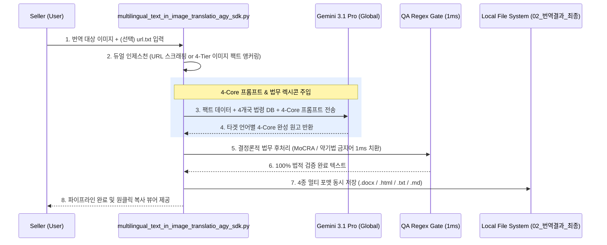

# 글로벌 크로스보더 SEO/GEO/AEO 다국어 자동 생성 파이프라인 설계서 (최신 4-Core 표준)

> **최종 개정일**: 2026-09-02  
> **목적**: 상품 상세페이지(PDP) 인페인팅 렌더링 후, 이커머스 상품 관리자(Seller Center) 등록용 검색 최적화(SEO/GEO/AEO) 텍스트 및 비교 테이블을 다국어(한국어, 영어, 중국어 간체/번체, 일본어 등)로 자동 생성하는 시스템의 아키텍처 및 템플릿 표준 정의서.

---

## 1. 아키텍처 개요 및 구동 엔진

- **핵심 엔진**: `gemini-3.1-pro-preview` (멀티모달 추론 전용)
- **리전 강제**: `location="global"` (Serverless 관리형 규격, 구글 공식 가이드 준수)
- **주요 기능**:
  - **하이브리드 듀얼 인제스천(Hybrid Dual Ingestion)**: `url.txt`(웹 상세페이지 링크)가 존재하면 실시간 HTML 텍스트를 0% 무손실로 긁어오며, 미출시 신제품의 경우 '고시표 이미지 앵커링'과 'INCI/KCID 사전 보정'으로 100% 무결점 팩트를 복원.
  - **4-Core 표준 포맷 강제**: 최신 AI 검색(Google AI Overviews, Perplexity, Amazon Rufus)이 수치 비교 데이터를 단일 진실(Ground Truth)로 인출할 수 있도록 **[스펙 비교 HTML Table]**을 포함한 4단계 구조화 강제.
  - **컴플라이언스 동기화**: `00_공통자료/compliance_lexicons/` 4개국 법무 렉시콘 및 `apply_deterministic_qa_overrides` 정규식 게이트 결합.
  - **트리플 익스포트**: `.docx` (MS Word 서식 문서), `.html` (원클릭 복사 뷰어), `.txt` (가독성 개행본), `.md` 4종 파일 일괄 자동 생성.

---

## 2. 워크플로우 다이어그램 (System Flow)

---

## 3. 핵심 출력 스펙 : 4-Core 마이크로-써머리 표준 포맷

모바일 가독성 향상 및 AI/검색 스파이더의 엔티티 파싱 효율 극대화를 위해 아래와 같은 **4단계 구조(4-Core Architecture)**를 100% 강제합니다.

### Sector 1. 공식 글로벌 이커머스 상품 타이틀 (Official E-Commerce Product Title)
- **제약 사항**: 공백 포함 100자 이내 엄수.
- **표준 공식**: `[브랜드명 Logicall Skin] + [{product_name}] + [핵심 효능] + [용량]`
- **브랜드/용어집 규칙**: 브랜드명은 고유 영문 명칭 **`Logicall Skin`**을 100% 유지하며, 번역된 상품명칭 적용.
- **특징**: 내부 개발자 용어("Generative AI", "GEO", "AEO" 등) 일체 배제 (Zero Meta Commentary).

### Sector 2. 핵심 가치 및 성분 마이크로-써머리 (Core Value & Active Ingredient Summary)
- **제약 사항**: 서술형 문장 배제, 정량 수치(ppm, %, 자극지수 0.00)가 포함된 5줄 자립형 청크(Self-Contained Chunks).
- **포맷 구조**:
  - **Brand**: Logicall Skin
  - **Core Ingredients**: (3~4개 핵심 유효 성분 및 정량 농도)
  - **Key Benefits**: (각국 화장품법 허용 효능 클레임)
  - **Texture & Absorption**: (제형 및 흡수력 특성)
  - **Skin Compatibility**: (저자극 지수 0.00 및 피부 적합성)

### Sector 3. 제품 상세 스펙 비교표 (Product Specifications & Comparison Table)
- **제약 사항**: 구글 AI Overviews 및 아마존 루퍼스가 긁어가기 쉬운 2차원 HTML `<table>` 구조.
- **포맷 구조**:
  - `구분 (Dimensions)`
  - `본 제품 (Logicall Skin)`
  - `일반 시판 제품 (Standard Market Benchmark)`
  - (성분 함량 ppm, 독자 특허 기술, 제형 안정성, 피부 자극 수치 비교)

### Sector 4. 제품 사용 가이드 및 5대 핵심 FAQ (Product Usage Guide & FAQ)
- **제약 사항**: 소비자가 가장 많이 묻는 5대 핵심 질문(사용 시점, 민감성 피부 적합성, 독자 성분 효능, 성분 시너지, 병행 사용법)에 대한 전문적인 답변.

---

## 4. 인풋 인제스천 아키텍처

1. **Case A (웹 URL이 있는 기존 제품)**:
   - `url.txt`에서 실시간 웹 HTML 텍스트를 스크래핑하여 0% 무손실 팩트 그라운딩 달성.
2. **Case B (웹 URL이 없는 미출시 신제품)**:
   - **고시표 이미지 앵커링(`is_table: true`)**: 법정 고시표 이미지를 1차 진실 소스로 락.
   - **INCI / KCID 사전 보정**: 화장품 공인 성분사전을 통해 OCR 오타 100% 자동 교정.
   - **멀티 이미지 3중 교차 검증**: 인포그래픽 수치(100,000ppm) ↔ 본품 라벨(10%) ↔ 고시표 순위 상호 검증.

---

## 5. 산출물 규격 (Triple Export + MD)

| 확장자 | 파일명 규격 | 주요 용도 및 특징 |
| :--- | :--- | :--- |
| **`.docx`** | `[상품명]_[언어]_SEO_GEO_AEO.docx` | **[실무 메인]** MS Word 서식 본문 복사 시 줄바꿈 및 볼드 완벽 보존 |
| **`.html`** | `[상품명]_[언어]_SEO_GEO_AEO_VIEWER.html` | 웹 브라우저에서 버튼 클릭 한 번으로 항목별/전체 HTML 복사 |
| **`.txt`** | `[상품명]_[언어]_SEO_GEO_AEO.txt` | 대량 ERP 등록 및 메모장 열람용 (CRLF 개행 보존) |
| **`.md`** | `[상품명]_[언어]_SEO_GEO_AEO.md` | 마크다운 에디터 및 아카이빙용 표준 문서 |