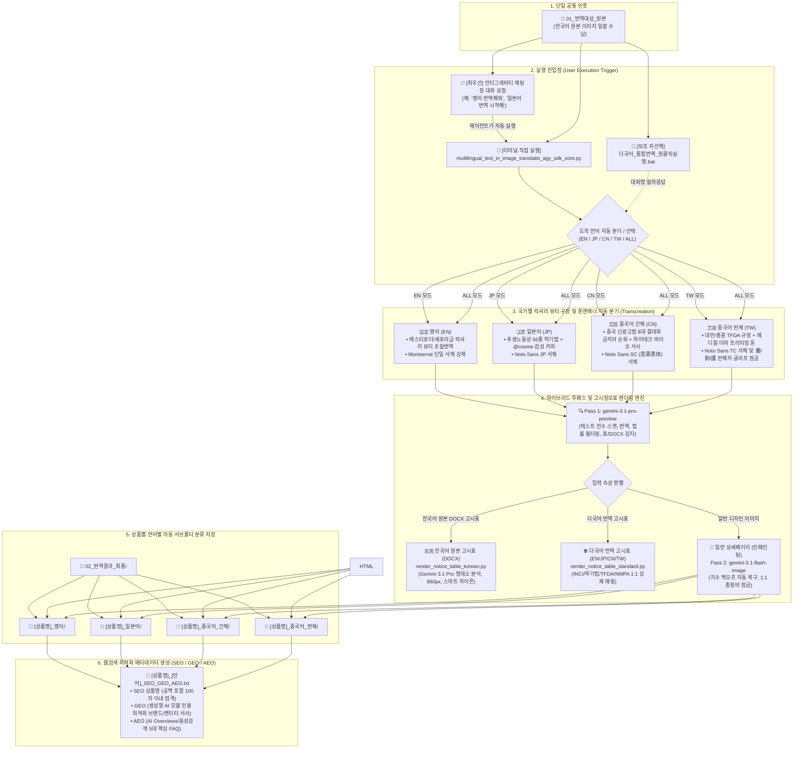

# multilingual_text_in_image_translatio_agy_sdk_core

한국어 원본 상세페이지/제품 이미지를 공통 폴더(`01_번역대상_원본`)에 넣고, 도착 언어(영어, 일본어, 중국어 간체/번체)를 선택하면 각 국가별 법률 및 폰트 규정에 맞추어 원클릭으로 일괄 번역·렌더링하는 통합 시스템입니다.

---

## 📁 주요 문서 링크
- 📊 **[워크플로우 차트 다이어그램](file:///C:/Users/euntaewoo/Desktop/multilingual_text_in_image_translatio_agy_sdk/multilingual_text_in_image_translatio_agy_sdk_core/워크플로우_차트_다이어그램.md)**: 전체 시스템 아키텍처 및 5단계 처리 흐름도
- 📖 **[3가지 실행 방법 가이드](file:///C:/Users/euntaewoo/Desktop/multilingual_text_in_image_translatio_agy_sdk/multilingual_text_in_image_translatio_agy_sdk_core/실행_방법_가이드.md)**: 안티그래비티 대화 요청 / CLI / BAT 실행 상세 가이드
- 🧬 **[기술적 기초 및 계승 내역 레퍼런스](file:///C:/Users/euntaewoo/Desktop/multilingual_text_in_image_translatio_agy_sdk/multilingual_text_in_image_translatio_agy_sdk_core/기술적_기초_및_계승_내역_레퍼런스.md)**: 프로토/영어/일본어/중국어 엔진의 핵심 기술 융합 내역

---

## 📊 워크플로우 차트 다이어그램 (System Architecture)



---
---

## ⚙️ 엔진 하이퍼파라미터 및 토큰 제원 (Hyperparameters & Token Limits)
- **4대 핵심 하이퍼파라미터 (GenerationConfig)**:
  - `temperature`: **0.6** (해외 광고법 준수 안전선 유지 및 럭셔리 초월번역 밸런스 확보)
  - `top_p`: **0.9** (하위 10% 투박한 직역 표현 배제 및 정제된 백화점 뷰티 어휘 필터링)
- **토큰 한도 이원화 및 안전 천장 (Token Limit Dualization & Safety Ceiling)**:
  - **대용량 데이터 추출 및 고시표 번역 (Pass 1 & Table Render)**: `max_output_tokens=8192` (전성분 등 방대한 화학 명칭 및 JSON 구조 유실 방지)
  - **마케팅 카피 및 SEO 생성 (SEO/GEO/AEO)**: `max_output_tokens=8192` (Thinking 토큰 잠식에 의한 Q4/Q5 잘림 방지 안전 천장 확보 + 프롬프트에서 FAQ 5개 및 간결 답변 엄격 제한)
- **HTML 뷰어 소제목 자동 삽입 (Section Heading Auto-Inclusion)**:
  - 섹터 2 및 섹터 3 복사 텍스트/HTML 최상단에 **번역 도착어 공식 소제목(예: `2. Core Value & Active Ingredient Summary`, `3. Product Usage Guide & Frequently Asked Questions (FAQ)`)**을 필수 자동 삽입.

> 💡 **[Temperature 0.6 공학적·수학적 배경 및 실측 제원 주석]**
> - **수학적 작동 원리 (Softmax 연산식)**: $P(w_i) = \frac{\exp(z_i / T)}{\sum_j \exp(z_j / T)}$
>   - $T$ (Temperature)는 다음 단어를 샘플링할 때 확률 분포의 평탄화(Flatness) 정도를 제어하는 조절 매개변수임.
> - **실측 동작 특성 비교**:
>   - `T = 0.5`: 상위 1~2개 고확률 단어에 선택이 집중되어 결정론적/보수적 연산 수행 (문장이 딱딱한 기계 직역으로 고착됨).
>   - `T = 0.7`: 하위 확률 단어의 채택 가능성이 높아져 무작위성 및 창의성은 증가하나, 원문에 없는 과장/절대화 금지어 환각 및 광고법 위반 리스크 급증.
>   - `T = 0.6`: 해외 화장품 광고법(미국 MoCRA, 대만 TFDA, 일본 약기법, 중국 NMPA) 위반 리스크 차단과 백화점·세포라급 럭셔리 초월번역(Transcreation) 감성 품질 간의 **최적 균형점(황금 비율)**.


---

### 💬 [방법 1: 최우선 권장] 안티그래비티 대화창 요청
- *"01_번역대상_원본에 이미지 넣었어, 영어로 번역해줘"*
- *"일본어 약기법 번역 시작해줘"*
- *"중국어 간체로 번역해줘"*
- *"전체 언어로 일괄 번역해줘"*

### 💻 [방법 2] 터미널에서 실행
```bash
# 상위 프로젝트 루트 기준
.venv\Scripts\python.exe multilingual_text_in_image_translatio_agy_sdk_core\multilingual_text_in_image_translatio_agy_sdk_core.py
```

### 🖱️ [방법 3: 차선책] 더블클릭 실행
- `다국어_통합번역_원클릭실행.bat` 더블클릭


---

## 🏆 초월번역(Transcreation) 품질 자동 평가 4대 루브릭 (100점 만점)
- **① 현지 카테고리 어휘 적합성 (30점)**: 콩글리시/직역투 배제, 현지 뷰티 플랫폼 네이티브 어휘 채택
- **② 국가별 광고법 무결성 (30점)**: 미국 MoCRA, 일본 약기법, 중국 NMPA/신광고법 위반 표현 100% 차단
- **③ 브랜드 감성 및 초월번역 완성도 (25점)**: 백화점·세포라급 하이엔드 뷰티 톤앤매너 및 구매 전환 설득력
- **④ 시각적 레이아웃 및 가독성 (15점)**: 텍스트 박스 침범 방지 및 간결한 문장 구조
- **[합격 기준 및 자가치유]**: **90점 이상 & 위반 0건 합격**, 미달 시 피드백 기반 **최대 2회 자동 재렌더링 및 `Transcreation_QA_Report.html` 발행**


## 6. 검색 최적화(SEO/GEO/AEO 4-Core) 및 듀얼 인제스천 규격
- 4-Core 표준: 1. 상품명(NPO) ➔ 2. 5줄 마이크로 요약 ➔ 3. 제품 상세 비교표(HTML Table) ➔ 4. 5대 핵심 FAQ
- 듀얼 인제스천: `url.txt` 웹 실시간 스크래핑 및 미출시 제품 4중 이미지 팩트 앵커링 지원
- 트리플 익스포트: `.docx`, `.html`, `.txt`, `.md` 4종 파일 일괄 자동 생성