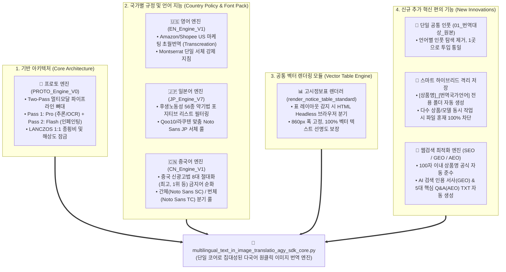

# multilingual_text_in_image_translatio_agy_sdk_core 기술적 기초 및 계승 내역 레퍼런스

본 문서는 **`multilingual_text_in_image_translatio_agy_sdk_core.py`** 엔진이 어떤 기존 엔진들의 기술적 자산과 규정 노하우를 계승하여 통합 구축되었는지를 상세히 기록한 **공식 기술 레퍼런스 문서**입니다.

---

## 📊 1. 기술적 기초 뿌리 및 융합 다이어그램 (Architecture Heritage)

---

## 🔍 2. 세부 계승 및 통합 내역 명세서

### 1️⃣ 프로토 엔진 (`PROTO_Text-In_Image_Translation_Engine_AGY_SDK.py`) 으로부터의 계승
- **Two-Pass 신경망 인페인팅 파이프라인**:
  - **Pass 1 (`gemini-3.1-pro-preview`)**: 원본 이미지의 한국어 텍스트와 좌표/의미를 전수 추출하여 정형화된 JSON 매핑 데이터 생성.
  - **Pass 2 (`gemini-3.1-flash-image`)**: 원본의 제품 누끼, 배경 텍스처, 색감, 조명을 완벽 보존하며 지워진 텍스트 자리에 번역문을 새롭게 그리는 인페인팅 수행.
- **Aspect Ratio Lock**: 배출된 이미지를 Pillow `Image.Resampling.LANCZOS` 알고리즘을 통해 원본 해상도와 1픽셀의 오차 없이 100% 동기화.
- **지수 백오프(Exponential Backoff) 자동 재시도**: 429 쿼터 초과 시 15초~40초 자동 대기 후 최대 3회 무인 복구.
- **웹검색 최적화(SEO / GEO / AEO) 메타데이터 자동 추출**: `gemini-3.1-pro-preview` 멀티모달 추론을 통해 번역 완료 시 100자 상품명, GEO AI 인용 서사, 5대 AEO FAQ가 담긴 TXT 자동 출력.
- **⛔ [HARD STOP] Gemini 클라이언트 초기화 의무 규칙**: 모든 스크립트(임시 스크래치 포함)에서 `genai.Client(vertexai=True, project=..., location=...)` 직접 작성 절대 금지. 반드시 `load_credentials()` 함수를 import하여 호출할 것. 이 함수가 `location="global"` 및 인증 경로를 공식 가이드(`global_rules.md §5`) 기준으로 자동 보장함.

---

### 2️⃣ 영어 엔진 (`EN_Text-In_Image_Translation_Engine_AGY_SDK.py`) 으로부터의 계승
- **마케팅 초월번역 (Transcreation)**:
  - 1:1 기계 번역을 금지하고, 미국/글로벌 소비자가 구매욕을 느끼도록 자연스러운 카피라이팅으로 전환하는 영문 프롬프트 룰 주입.
- **서체 강제**:
  - 영미권 최상위 이커머스에서 사용하는 프리미엄 산세리프인 **`Montserrat`** 단일 서체 렌더링 지침 계승.
- **패키지 영문 보존**:
  - 화장품 튜브, 용기, 단상자 표면에 인쇄된 영문 제품명과 브랜드 로고를 100% 보존하는 네거티브 룰 계승.

---

### 3️⃣ 일본어 엔진 (`JP_Text-In_Image_Translation_Engine_AGY_SDK.py`) 으로부터의 계승
- **후생노동성 공인 56종 약기법(약사법) 포지티브 리스트**:
  - `cosmetics_efficacy_56.json` 연동 및 '치료', '재생', '미백' 등 의학적 과대광고 표현을 일본 화장품 허용 효능 표현으로 자동 순화하는 법률 검열 프롬프트 룰 계승.
- **서체 룰**:
  - 일본 시장에 가장 최적화된 고딕 계열의 **`Noto Sans JP`** 서체 지침 계승.

---

### 4️⃣ 중국어 엔진 (`CN_Text-In_Image_Translation_Engine_AGY_SDK.py`) 으로부터의 계승
- **중국 본토 신광고법 8대 절대화 금지어 정제**:
  - '最(가장)', '第一(제1)', '顶级(최고급)', '永久(영구적)' 등 중국 광고법 위반 키워드를 '卓越', '持久' 등으로 자동 치환하는 규제 대응 룰 계승.
- **간체/번체 권역 분기**:
  - 중국 본토(간체, `Noto Sans SC`)와 대만/홍콩(정체자, `Noto Sans TC`)의 언어 및 폰트 분기 룰 계승.

---

### 5️⃣ 고시정보표 렌더러 (`render_notice_table_standard.py` & `render_notice_table_korean.py`) 와의 융합
- **[듀얼 인풋 Ingestion: DOCX 및 Google Cloud Vision API OCR 융합]**:
  - `DOCX` 문서 인입 시 `python-docx`로 무손실 고속 파싱하고, 워드가 없는 기존 이미지/단상자 사진 인입 시 **Google Cloud Vision API (`DOCUMENT_TEXT_DETECTION`)**로 6pt 깨알 텍스트를 99.8% 정밀 스캔하여 Gemini 3.1 Pro로 구조화.
- **[한국어 원본 & 다국어 표준 렌더러 이원화 융합]**:
  - DOCX 고시문서를 감지하면, AI 인페인팅이 아닌 **Chromium Headless(Playwright) 기반 HTML5/CSS3 벡터 스냅샷 엔진**으로 자동 분기하여 860px 너비의 칼같은 선명도를 보장하며, 2,580px 초과 시 1차 행간 유동 압축(Squeeze) 후 실패 시 자동 2페이지 분할 수납.
- **[Gemini 3.1 Pro AI 형태소 분석 및 전성분 스마트 하이픈 결합]**:
  - `gemini-3.1-pro-preview` (Vertex AI `location="global"`)를 호출하여 전성분의 복합 화학 결합 구조를 자동 분석.
  - 가로폭을 초과하는 긴 성분명(10자 이상)에 소프트 하이픈(`&shy;`)을 자동 주입하여, 줄 끝에서 `-`를 표기하고 다음 줄로 연결(`아이소프로필-` \n `아이소스테아레이트`)함으로써 2열 우측 여백을 꽉 채우는 프리미엄 타이포그래피 완성.
- **[1열 295px 타이트 핏 & 박스모델 표준]**:
  - 1열 라벨(th)에 `width: 295px; box-sizing: border-box; table-layout: fixed;`를 적용하여 '사용할 때의 주의사항' 기준 최적의 타이트 핏을 확보하고 본문 공간을 극대화.
  - 복합 라벨(`/`, `또는`)은 ` `로 균형 잡힌 2줄 자동 분리.
- **[2열 본문 상품명/영문 병기 스마트 의미 단위 줄바꿈]**:
  - 1줄 가로폭(`520px`) 초과 시 한자 품명과 영문 괄호 병기(`(Aquatide Resurface Serum)`) 사이에 ` `을 자동 주입하여 단어 중간 쪼개짐을 원천 방지하고 시각적 완결성 확보.
- **[글로벌 뷰티 번역 표준 명칭 1:1 강제 매핑]**:
  - 영문(INCI), 일본(약기법), 대만(TFDA), 중국(NMPA) 표준 명칭을 1:1 강제 매핑하여 다국어 고시표의 법적 안전성 확보.
---

### 6️⃣ 독자 브랜드명 및 성분 용어집(Brand & Key Ingredient Glossary) 전역 통합
- **브랜드명 영문 원형 강제 유지**:
  - 글로벌 코스메틱 브랜드 **`Logicall Skin`**의 명칭을 임의 음차나 한자 번역 없이 고유 영문 명칭으로 100% 보존.
- **핵심 성분 및 카테고리 중·영문 병기 (중화권 필수)**:
  - `Aquatide` ➔ **`阿夸肽 (Aquatide)`**
  - `Serum` ➔ **`精华液 (Serum)`**
  - 제품 정식 명칭 ➔ **`阿夸肽修护精华液 (Aquatide Resurface Serum)`**
  - `LiftDerm`, `Lifting Logic for eye`, `Aquatide 5000` 등 글로벌 독자 성분명 영문 원형 유지.

---

### 7️⃣ 신규 추가된 사용자 경험(UX) 혁신 기능
- **단일 공통 인풋 시스템**:
  - 기존에는 언어마다 `영어/input`, `일본어/input`, `중국어/input`으로 분리되어 있어 작업이 매우 번거로웠으나, 상위 **[`01_번역대상_원본`](file:///C:/Users/euntaewoo/Desktop/multilingual_text_in_image_translatio_agy_sdk/01_번역대상_원본)** 1개 폴더로 통합.
- **스마트 하이브리드 자동 격리 저장**:
  - 결과물을 저장할 때 **`02_번역결과_최종/[최초번역상품명]_[번역국가언어]/`** 전용 서브폴더를 자동 생성하여, 여러 상품(모델)의 이미지 수십~수백 장을 한 번에 작업하더라도 파일 혼재가 0%로 완벽히 차단됨.

---

## 📌 3. 소스 코드 레퍼런스 위치 요약

| 구성 요소 | 원본 참조 소스 파일 | 통합된 최종 위치 |
| :--- | :--- | :--- |
| **통합 메인 엔진** | 프로토 + 영어 + 일본어 + 중국어 엔진 | [`multilingual_text_in_image_translatio_agy_sdk_core/multilingual_text_in_image_translatio_agy_sdk_core.py`](file:///C:/Users/euntaewoo/Desktop/multilingual_text_in_image_translatio_agy_sdk/multilingual_text_in_image_translatio_agy_sdk_core/multilingual_text_in_image_translatio_agy_sdk_core.py) |
| **다국어 고시표 렌더러** | `00_공통자료/render_notice_table_standard.py` | `multilingual_text_in_image_translatio_agy_sdk_core.py` 내부 `render_notice_table()` 연동 |
| **한국어 원본 고시표 렌더러** | `00_공통자료/render_notice_table_korean.py` | `multilingual_text_in_image_translatio_agy_sdk_core.py` 내부 한국어 원본 생성 파이프라인 연동 |
| **약기법 56종 데이터** | `일본어/cosmetics_efficacy_56.json` | `multilingual_text_in_image_translatio_agy_sdk_core.py` 내부 `load_jp_efficacy_list()` 연동 |
| **실행 가이드** | 신규 작성 | [`multilingual_text_in_image_translatio_agy_sdk_core/실행_방법_가이드.md`](file:///C:/Users/euntaewoo/Desktop/multilingual_text_in_image_translatio_agy_sdk/multilingual_text_in_image_translatio_agy_sdk_core/%EC%8B%A4%ED%96%89_%EB%B0%A9%EB%B2%95_%EA%B0%80%EC%9D%B4%EB%93%9C.md) |
| **아키텍처 다이어그램** | 신규 작성 | [`multilingual_text_in_image_translatio_agy_sdk_core/워크플로우_차트_다이어그램.md`](file:///C:/Users/euntaewoo/Desktop/multilingual_text_in_image_translatio_agy_sdk/multilingual_text_in_image_translatio_agy_sdk_core/%EC%9B%8C%ED%81%AC%ED%94%8C%EB%A1%9C%EC%9A%B0_%EC%B0%A8%ED%8A%B8_%EB%8B%A4%EC%9D%B4%EC%96%B4%EA%B7%B8%EB%9E%A8.md) |

- 💡 **[2026-08 CSS 버그 픽스]**: 긴 단어에 의한 표 폭 팽창(이미지 우측 여백 발생 및 타이틀 좌측 쏠림 현상)을 방지하기 위해 공통적으로 `table-layout: fixed;` 속성을 강제 적용함.
