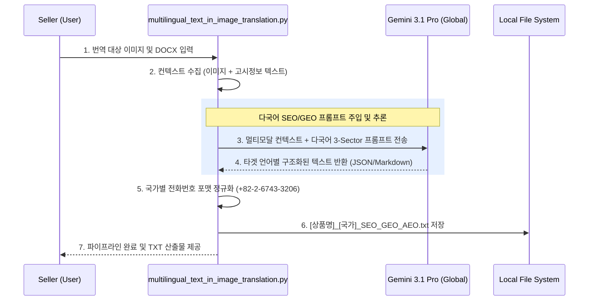

# 글로벌 크로스보더 SEO/GEO/AEO 다국어 자동 생성 파이프라인 설계서

> **작성일**: 2026-08-20  
> **목적**: 상품 상세페이지(PDP) 인페인팅 렌더링 후, 이커머스 상품 관리자(Seller Center) 등록용 검색 최적화(SEO/GEO/AEO) 텍스트를 다국어(한국어, 영어, 중국어, 일본어 등)로 자동 생성하는 시스템의 아키텍처 및 템플릿 표준 정의서. 향후 에이전트 및 개발자가 재사용 및 유지보수 시 본 문서를 기준으로 구동 원리를 파악함.

---

## 1. 아키텍처 개요 및 구동 엔진

- **핵심 엔진**: `gemini-3.1-pro-preview` (멀티모달 추론 전용)
- **리전 강제**: `location="global"` (Serverless 관리형 규격, 구글 공식 가이드 준수)
- **주요 기능**:
  - 원본 상품 이미지(멀티모달 분석)와 상품 고시정보(DOCX 메타데이터)를 융합하여 상품의 성분, 효능, 특장점을 스스로 파악.
  - 최신 검색 엔진 및 생성형 AI 검색(GEO: Generative Engine Optimization)에 최적화된 **구조화된 데이터 포맷(Structured Data)**으로 텍스트를 자동 작성.
  - 이커머스 입점 시(아마존, 큐텐, 쇼피 등) 복사-붙여넣기만 하면 되도록 불필요한 서술형 문장을 배제하고 **Micro-Summary** 포맷 강제.

---

## 2. 워크플로우 다이어그램 (System Flow)

---

## 3. 핵심 출력 스펙 : 3-Sector 마이크로-써머리 표준 포맷

과거의 장황한 산문형 방식에서 탈피하여, **모바일 가독성 향상 및 AI/검색 스파이더의 엔티티 파싱 효율 극대화**를 위해 아래와 같은 3단계 초간결 구조(Ultra-Compact Micro-Summary)를 100% 강제합니다. (모든 소제목은 타겟 국가의 언어로 번역되어 출력됨)
- **[마크다운 특수기호 사용 금지]**: 각 이커머스/쇼핑몰 플랫폼의 등록 시 특수문자 입력 제한(오류)을 방지하기 위해 `##`, `**`, `-` 등의 마크다운 기호 사용을 전면 배제하고, 메인 섹션은 `1.`, `2.` 형태로 구분하고, 하위 특성 리스트는 반드시 `1)`, `2)`, `3)` 형태로 순번을 마킹하여 시각적으로 계층을 분리합니다.

### Sector 1. 공식 글로벌 이커머스 상품 타이틀 (Official E-Commerce Product Title)
- **제약 사항**: 공백 포함 100자 이내 엄수.
- **표준 공식**: `[브랜드명] + [핵심 특허/성분] + [상품 정규명] + [핵심 효능] + [용량]`
- **특징**: 내부 개발자 용어("Generative AI Search" 등) 배제. B2C 고객 지향적 타이틀 노출.

### Sector 2. 핵심 가치 및 성분 마이크로-써머리 (Core Value & Active Ingredient Summary)
- **제약 사항**: 서술형 문장/단락 절대 금지. 5줄 이내의 단답형 키워드 리스트 강제.
- **포맷 구조 (Key-Value 매핑)**:
  - **Brand**: (1줄 철학)
  - **Core Ingredients**: (콤마 구분된 3~4개 핵심 성분)
  - **Key Benefits**: (콤마 구분된 3~4개 핵심 효능)
  - **Formulation**: (콤마 구분된 2~3개 제형/배합 특징)
  - **Search Tags**: (SEO 노출용 10대 해시태그/검색어)

### Sector 3. 사용 가이드 및 소비자 FAQ (Product Usage Guide & FAQ)
- **제약 사항**: 이커머스에서 가장 많이 묻는 5대 질문(효능, 사용법, 민감성, 성분 시너지, 보관/CS)에 대한 상세하고 친절한 답변 제공.
- **특징**: 고객센터 번호(`+82-2-6743-3206`) 필수 포함 규정 강제 적용.

---

## 4. 프롬프트 엔지니어링 재사용 가이드 (Maintainer Guide)
- 파이프라인 프롬프트를 수정할 경우 `multilingual_text_in_image_translation.py` 내의 `generate_seo_geo_aeo_txt` 함수에 선언된 `prompt_kr`, `prompt_en`, `prompt_cn`, `prompt_jp`, `prompt_tw` 변수를 직접 수정합니다.
- **금지어 리스트 유지**: 프롬프트 상단에 "Generative AI, GEO, AEO, Knowledge Graph Dossier 등 개발자 용어를 노출하지 말 것"이라는 `[CRITICAL INSTRUCTION]` 헤더를 반드시 유지해야 LLM이 혼동하여 B2C 문서에 해당 단어를 노출하는 사고를 막을 수 있습니다.
- 코드 수정 완료 후, 본 설계서 내용에 위배됨이 없는지 검토한 뒤 깃허브 원격 저장소에 Commit & Push 합니다.

## [신규 추가] 상품상세정보 고시 테이블 렌더링 규격 (DOCX to PNG)
- **가로 사이즈**: 전체 캔버스 860px 고정 (컨테이너 820px)
- **세로 사이즈**: 최대 2,580px (초과 시 우선 행간 유동 압축(Squeeze) 시도 후, 실패 시 Part1, Part2 분할 적용)
- **다국어 폰트 최적화 규격 (타이포그래피 차등 적용)**: 
  - **한국어/영어 (Pretendard), 일본어 (Noto Sans JP)**: 타이틀 `64px`, 본문 `32px`
  - **중국어 간체/번체 (Alibaba PuHuiTi / Noto Sans SC)**: 글자가 뚱뚱해지는 한자(방괴자) 특성을 고려하여 다운스케일링 적용 ➔ 타이틀 `52px`, 본문 `26px`
- **1. [Smart Layout] 1열 고정폭(295px) 및 2열 오버플로우 방지 룰**
   - **1열 라벨(th)**: 기존 유동폭을 폐지하고 295px 최적 고정폭으로 회귀 및 `width: 295px; (table-layout: fixed) word-break: keep-all;` 로 의미 단위 유동폭 적용. `/`, `또는`, `or`, `または`, `或` 등의 복합어는 파이썬에서 ` ` 주입.
   - **2열 본문(td)**: 무식한 강제 줄바꿈(`break-all`)을 폐기하고, `word-break: keep-all; overflow-wrap: break-word;` 적용. 전성분 번역 시 **국제화장품원료집(INCI) 및 한국화장품성분사전(KCID) 표준 명칭과 해당 국가 표기법**을 준수하여 전문적인 포맷팅(띄어쓰기/콤마)을 통해 자연스러운 의미 단위 줄바꿈을 유도함.
- **[핵심] 글로벌 뷰티 번역 표준 명칭 (이커머스/현지 법령 강제 매핑)**:
  - **영어 (Amazon/Sephora US)**: 
    - 용량: `Size / Net Wt.` | 피부타입: `Skin Type` | 기한: `Shelf Life / PAO` | 사용법: `Directions` | 성분: `Ingredients`
  - **일본어 (약기법/Qoo10 Japan)**:
    - 용량: `内容量` | 피부타입: `お肌のタイプ / 対象肌` | 기한: `使用期限` | 사용법: `ご使用方法` | 성분: `全成分`
  - **대만 번체 (TFDA/Shopee TW)**:
    - 용량: `淨含量 / 容量` | 피부타입: `適用膚質` | 기한: `保存期限` | 사용법: `使用方法` | 성분: `全成分`
  - **중국어 간체 (NMPA/Tmall)**:
    - 용량: `净含量 / 容量` | 피부타입: `适用肤质 / 产品规格` | 기한: `使用期限 / 保质期` | 사용법: `使用方法` | 성분: `全成分`
- **렌더링 엔진**: docx_to_html.py 내 HTML/CSS 하드코딩 모듈 가동 후 html2image 스냅샷 처리 및 여백 크롭 렌더링 수행.

- 💡 **[2026-08 CSS 버그 픽스]**: 긴 단어에 의한 표 폭 팽창(이미지 우측 여백 발생 및 타이틀 좌측 쏠림 현상)을 방지하기 위해 공통적으로 `table-layout: fixed;` 속성을 강제 적용함.
