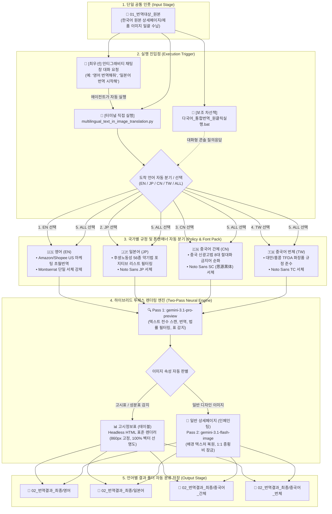

# multilingual_text_in_image_translation 워크플로우 차트 다이어그램

본 문서는 **`multilingual_text_in_image_translation`** 엔진의 전체 아키텍처 및 5단계 하이브리드 처리 흐름을 도식화한 공식 다이어그램 문서입니다.

---

## 📊 1. 시스템 워크플로우 아키텍처 다이어그램

---

## 📌 2. 5단계 핵심 파이프라인 명세표

| 단계 | 단계명 | 적용 기술 및 수행 작업 | 주요 산출물 / 특징 |
| :---: | :--- | :--- | :--- |
| **1단계** | **단일 공통 인풋** | 상위 `01_번역대상_원본/` 폴더에 원본 이미지 배치 | 언어별 폴더 복사 불필요 |
| **2단계** | **실행 진입점** | 안티그래비티 대화창 요청, Python CLI, BAT 런처 | 도착어 파라미터(`--lang`) 전달 |
| **3단계** | **규정/폰트 분기** | 국가별 광고법, 약기법(56종), 초월번역 지침 주입 | Noto Sans JP/SC/TC, Montserrat |
| **4단계** | **투패스 렌더링** | `Pass 1` (Pro 추론/OCR/표감지) ➔ `Pass 2` (Flash 인페인팅 / HTML 렌더러) | 1:1 비율 보존, 표 벡터 선명도 |
| **5단계** | **자동 분류 저장** | `02_번역결과_최종/[언어명]/` 폴더로 다이렉트 안착 | 언어별 완제품 즉시 활용 가능 |
