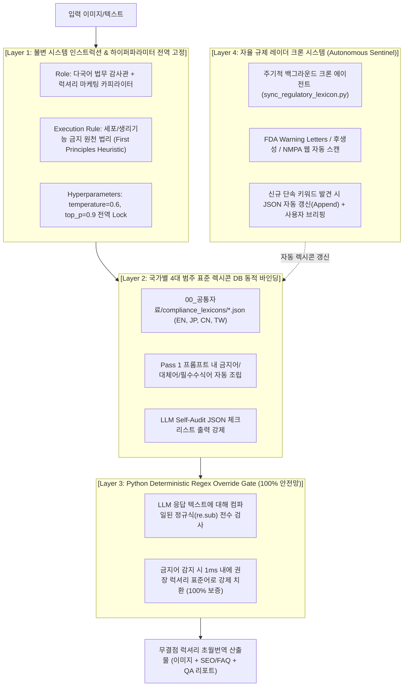

# 글로벌 컴플라이언스(법무) & 럭셔리 마케팅 초월번역 파이프라인 전면 개편 및 자율 규제 동기화 시스템 도입 계획서

본 계획서는 `C:\Users\euntaewoo\Desktop\multilingual_text_in_image_translatio_agy_sdk_uv-version` 프로젝트를 대상으로, 단순 기계 번역에서 발생하던 **5대 법적 리스크 및 K-뷰티 콩글리시 문제를 원천 차단**하고, **'다국어 법무팀(FDA/약기법/신광고법) + 현지 럭셔리 마케팅 카피라이터'**의 역할을 시스템 전역에 고정하며, **신규 규제 자동 감지(Sentinel System)**까지 완결하는 구체적인 아키텍처 및 도입 방안을 정의합니다.

---

## 1. 시스템 아키텍처 및 4계층 방어막 구조

---

## 2. 구체적 도입 위치 및 파일별 수정 상세 내역 (Proposed Changes)

### A. [신규 구축] 국가별 표준 컴플라이언스 렉시콘 데이터베이스
- **위치**: `00_공통자료/compliance_lexicons/`
- **신규 생성 파일 4종**:
  1. `en_fda_mocra_lexicon.json`: 미국 FDA MoCRA & FTC 규정 (세포 기전 금지, 노화 징후 한정, K-뷰티 콩글리시 ➔ Sephora 표준어 매핑 등)
  2. `jp_pmda_pharm_lexicon.json`: 일본 후생노동성 약기법 56종 공인 효능 및 의약품 오인 방지 매핑
  3. `cn_nmpa_adlaw_lexicon.json`: 중국 NMPA 화장품 감독관리조례 및 신광고법 8대 절대화 금지어(`最`, `第一`, `顶级` 등) 매핑
  4. `tw_tfda_lexicon.json`: 대만 위생복리부 TFDA 화장품 표기 기준 매핑

### B. [신규 구축] 자율 규제 레이더 동기화 스크립트
- **위치**: [sync_regulatory_lexicon.py](file:///c:/Users/euntaewoo/Desktop/multilingual_text_in_image_translatio_agy_sdk_uv-version/00_공통자료/sync_regulatory_lexicon.py)
- **기능**:
  - 미국 FDA Warning Letters DB, 일본 후생성, 중국 NMPA 최신 고시 웹 피드를 자동 탐색
  - 신규 단속 성분/클레임 감지 시 `compliance_lexicons/*.json` 파일에 자동 추가(Append)
  - Antigravity `schedule` 크론 또는 독립 실행 지원

### C. [코드 수정] 통합 코어 번역 엔진
- **위치**: [multilingual_text_in_image_translation.py](file:///c:/Users/euntaewoo/Desktop/multilingual_text_in_image_translatio_agy_sdk_uv-version/multilingual_text_in_image_translatio_agy_sdk_core/multilingual_text_in_image_translation.py) 및 [multilingual_text_in_image_translatio_agy_sdk.py](file:///c:/Users/euntaewoo/Desktop/multilingual_text_in_image_translatio_agy_sdk_uv-version/multilingual_text_in_image_translatio_agy_sdk.py)
- **수정 내용**:
  1. `types.GenerateContentConfig` 호출 시 `system_instruction=GLOBAL_COMPLIANCE_SYSTEM_INSTRUCTION`, `temperature=0.6`, `top_p=0.9` 전역 고정.
  2. `load_compliance_lexicons(lang_code)` 함수를 신설하여 `00_공통자료/compliance_lexicons/`에서 동적으로 렉시콘 로드.
  3. `build_prompts()` 내에 국가별 4대 범주 규칙 및 원천 법리(First Principles Heuristic) 자동 조립 주입.
  4. `apply_deterministic_qa_overrides()` 함수 내에 JSON 렉시콘 기반의 정규식 자동 치환 엔진 탑재.

### D. [코드 수정] 개별 언어별 독립 엔진
- **위치**:
  - [EN_Text-In_Image_Translation_Engine_AGY_SDK.py](file:///c:/Users/euntaewoo/Desktop/multilingual_text_in_image_translatio_agy_sdk_uv-version/영어/EN_Text-In_Image_Translation_Engine_AGY_SDK.py)
  - [JP_Text-In_Image_Translation_Engine_AGY_SDK.py](file:///c:/Users/euntaewoo/Desktop/multilingual_text_in_image_translatio_agy_sdk_uv-version/일본어/JP_Text-In_Image_Translation_Engine_AGY_SDK.py)
  - [CN_Text-In_Image_Translation_Engine_AGY_SDK.py](file:///c:/Users/euntaewoo/Desktop/multilingual_text_in_image_translatio_agy_sdk_uv-version/중국어/CN_Text-In_Image_Translation_Engine_AGY_SDK.py)
- **수정 내용**:
  - `system_instruction` 분리 적용, 공통 렉시콘 로더 연동, 하이퍼파라미터(0.6 / 0.9) 동기화.

### E. [코드 수정] 초월번역 QA 품질 평가 엔진
- **위치**: [multilingual_transcreation_qa_evaluator_agy_sdk.py](file:///c:/Users/euntaewoo/Desktop/multilingual_text_in_image_translatio_agy_sdk_uv-version/multilingual_text_in_image_translatio_agy_sdk_core/multilingual_transcreation_qa_evaluator_agy_sdk.py)
- **수정 내용**:
  - 4대 평가 루브릭 중 `ad_law_compliance` 및 `domain_relevance` 채점 로직에 신규 렉시콘 DB 대조 검증 룰 추가.
  - 세포 클레임(`cellular vitality` 등) 및 노화 징후 한정 누락(`combats aging`) 발견 시 자동 감점 및 필수 교정 피드백 발생.

---

## 3. 4단계 단계별 실행 및 검증 계획 (Execution & Verification Plan)

### Step 1: 렉시콘 데이터베이스 & 동기화 모듈 구축
- `00_공통자료/compliance_lexicons/` 폴더 생성 및 4개국 JSON DB 작성.
- `sync_regulatory_lexicon.py` 스크립트 작성 및 동적 파싱 단위 테스트.

### Step 2: 엔진 소스코드 전면 동기화
- 코어 엔진 및 개별 언어 엔진의 API 호출부(`system_instruction`, `temperature=0.6`, `top_p=0.9`) 및 프롬프트 빌더 수정.
- Python 후처리 `apply_deterministic_qa_overrides()` 정규식 게이트 고도화.

### Step 3: QA 품질 평가 엔진 및 SEO 모듈 동기화
- `multilingual_transcreation_qa_evaluator_agy_sdk.py`의 루브릭 기준을 신규 렉시콘과 동기화.

### Step 4: 실전 재검증 및 최종 완결 검증
- 문제 대상 폴더인 `04_번역교정/LogicallySkin_MultiVitaminSerum_영어`에 대해 새로운 컴플라이언스 엔진으로 재번역 실행.
- 생성된 `LogicallySkin_MultiVitaminSerum_EN_SEO_GEO_AEO.txt` 및 렌더링 이미지에서 5대 문제 표현이 완벽히 교정되었는지 전수 실측 검증.
- `Transcreation_QA_Report.html`을 재발행하여 100점 만점 무결점 통과 확인.

## [PRE-EXPORT-INTEGRITY-VERIFICATION-LOCK] 결과물 내보내기 전 사전 무결성 검증 및 리포트 선-출력 강제
1. **[HARD STOP] 결과물 파일 내보내기 전 무조건 사전 검증 실행**:
   - 결과물 파일(.png, .html, .docx, .txt, .md 등)을 생성·저장·보고하기 전, 데이터 무결성과 포맷 규격을 체크하는 검증 함수(`pre_export_integrity_check`) 및 린터를 무조건 실행해야 합니다.
2. **[REPORT-FIRST] 데이터 무결성 요약 리포트 선-출력 의무화**:
   - 에이전트는 최종 결과물이나 파일 링크를 사용자에게 제시하기 전, 반드시 응답 상단에 `### 📋 [DATA-INTEGRITY-SUMMARY-REPORT]` 요약 리포트 표(포맷 무결성, 콩글리시/금지어 0건 여부, 수치 일치성, 4종 파일 생성 여부)를 먼저 출력하여 검증 결과를 입증해야 합니다. 이 리포트 출력이 누락된 답변은 즉시 무효로 간주합니다.
3. **[GLOBAL-COMPLIANCE] 영미권/글로벌 뷰티 표준 명칭 강제**:
   - 무자극/저자극: 한국 성적서 0.00 직역투 배제 -> `Hypoallergenic & Dermatologist-tested for sensitive skin` 표준 강제.
   - 피부톤 케어: 'Tone Care / Dark Spot & Tone Care' 콩글리시 배제 -> `Dark Spot & Discoloration Defense` 표준 강제.
