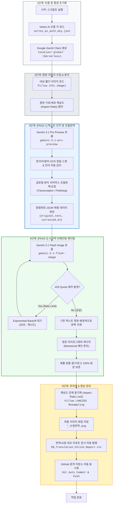

# 🇺🇸 EN_Text-In_Image_Translation_Engine_V1 동작 흐름 및 기술 스택 가이드

본 문서는 **다국어 이미지 번역 시스템 (영어 파이프라인)**에 적용된 핵심 엔진(`EN_Text-In_Image_Translation_Engine_V1.py`)의 동작 흐름과 단계별 기술 스택(Tech Stack)을 정리한 표준 기술 문서입니다.

---

## 📊 1. 엔진 작업 동작 흐름 플로우차트 (Workflow Flowchart)

---

## 🛠️ 2. 단계별 적용 기술 스택 (Tech Stack Summary)

| 단계 | 주요 기능 | 적용 기술 스택 (Core Technology) | 핵심 역할 및 설명 |
| :--- | :--- | :--- | :--- |
| **0. Auth** | 클라우드 인증 | **Google Cloud Vertex AI** (`google-genai` SDK) | `location="global"` 기반의 Serverless 관리형 공식 표준 엔드포인트 연결 |
| **1. Pass 1** | 인지 및 초월번역 | **`gemini-3.1-pro-preview`** (추론 엔진) | • 다국어 OCR 정밀 스캔 • 한국어 ➔ 영문 초월번역(Transcreation) • 기존 영문 ➔ 네이티브 표현 다듬기(Polishing) • 구조화된 JSON 데이터 출력 |
| **2. Pass 2** | 이미지 재렌더링 | **`gemini-3.1-flash-image`** (생성 엔진) | • 기존 텍스트 배경색 매칭 삭제 (Seamless Inpainting) • **글로벌 프리미엄 산세리프 `Montserrat` (몬세라트) 메인 폰트 재식자** • 제품 패키지/로고 원형 보존 |
| **3. Retry** | 통신 안정성 | **Exponential Backoff Algorithm** | 429 Resource Exhausted (분당 쿼터 제한) 발생 시 25초~ 점진적 대기 후 자동 재시도 |
| **4. Post-Proc**| 해상도 보존 | **Python Pillow (LANCZOS)** | 원본 픽셀 종횡비(Aspect Ratio) 및 가로/세로 해상도 1:1 강제 일치 복원 (크롭/찌그러짐 방지) |
| **5. DevOps** | 형상 관리 | **Git / GitHub Repository (PANDORA)** | 소스코드 및 기술 문서 변경 시 원격 저장소(`main` 브랜치) 실시간 자동 커밋 및 푸시 |
| **6. Notice Spec** | 고시정보 표 렌더링 | **Headless Edge + Pretendard** | 가로 860px 고정, 세로 Auto-Fit (최대 2,580px 이하, 초과 시 1차 행간 유동 압축(Squeeze), 실패 시 2페이지 분할), 타이틀 64px, 본문 32px, 1열 좌측 중앙정렬 및 유동폭 적용, 2열 스마트 레이아웃 적용 |

---

## 💡 3. 엔진 핵심 아키텍처 및 폰트 표준화 규칙

1. **영문 표준 폰트 철저 격리 원칙 (Strict Font Isolation Rule)**:
   - **메인 이미지 및 상세페이지 텍스트**: 글로벌 이커머스 표준 지오메트릭 산세리프인 **`Montserrat (몬세라트)` 100% 단일 서체만 강제 적용**합니다. (AI 인페인팅 엔진 내 타 서체/Pretendard 혼용 절대 금지)
   - **상품상세정보(고시정보) 테이블**: 데이터 가독성 및 정렬을 위해 오직 독립 Headless HTML 모듈(`render_notice_table_standard.py`)에서만 **`Pretendard` 폰트**를 전용 분리 적용합니다.

2. **지능형 언어 자동 감지 (Auto-Detect Dual Mode)**:
   - 이미지 속 텍스트가 한글이면 자동으로 `TRANSLATE_KR_TO_EN` 모드로 동작하여 한글을 영어로 초월번역합니다.
   - 이미지 속 텍스트가 영어이면 자동으로 `POLISH_EN_TO_EN` 모드로 동작하여 어색한 콩글리시/문법 오류를 네이티브 이커머스 표현으로 다듬어 교정합니다.

3. **완전 재생성 원칙 (Full Regeneration Rule)**:
   - 오류나 수정 발생 시 국소 덧칠(Patching)을 금지하고 전체 캔버스를 처음부터 끝까지 완전하게 다시 생성하여 무결점 퀄리티를 유지합니다.

4. **상품 패키지 원본 보존 (Product Package Text & Logo Protection)**:
   - 화장품 용기, 튜브, 단상자 등에 인쇄된 원본 로고와 텍스트는 인페인팅 대상에서 제외하여 패키지 고유의 시각적 형태를 100% 보존합니다.

5. **상품 정보 고시 표 표준 렌더링 규격 (Notice Table Rendering Standard)**:
   - 가로 폭: **전체 캔버스 `860px` 고정 (내부 컨테이너 `820px`)**
   - 세로 높이: **`Auto-Fit` (최대 허용치 `2,580px` 이하, 초과 시 1차 행간 유동 압축(Squeeze), 실패 시 2페이지 자동 분할)**
   - 고시표 전용 폰트: **`Pretendard`** (Bold 700 / Regular 400)
   - 폰트 크기: **타이틀 `64px` (Bold), 항목명 `32px`, 본문 `32px`**
   - 1열 (라벨) 규격: **`min-width: 200px; max-width: 320px; word-break: keep-all; text-align: left; vertical-align: middle;` (의미단위 유동폭 및 좌측 중앙정렬 적용)**
   - 2열 (본문) 규격: **`word-break: keep-all; overflow-wrap: break-word; text-align: left; vertical-align: middle;` (텍스트 이탈 방지 및 좌측 중앙정렬 적용)**
   - 지능형 줄바꿈: **`/`, `또는`, `or`, `または`, `或` 등 복합어 기준 자동 ` ` 삽입**
   - **[핵심] 영어 번역 표준 명칭 (아마존/세포라 기준 강제 매핑)**:
     - 용량/중량 ➔ `Size / Net Wt.`
     - 주요 사양 ➔ `Skin Type`
     - 기한/개봉후 ➔ `Shelf Life / PAO`
     - 사용방법 ➔ `Directions`
     - 제조업자/책임판매업자 ➔ `Manufacturer / Distributed by`
     - 전성분 ➔ `Ingredients`
   - 렌더러: `00_공통자료/render_notice_table_standard.py` 표준 모듈 사용

6. **글로벌 럭셔리 뷰티 초월번역 및 규제 준수 표준 규격 (Global Luxury Beauty Transcreation & Compliance Standard)**:
   - **페르소나**: 에스티로더, 랑콤 등 글로벌 하이엔드 코스메틱 10년 차 수석 CD 및 엘리트 카피라이터 페르소나 적용.
   - **직역 부사 금지**: `Definitely`, `Truly`, `Really`, `Certainly` 등 기계적 부사 직역 전면 금지 ➔ 능동적 럭셔리 뷰티 동사/형용사 재창조.
   - **성분 구문 결속**: "10% LiftDerm" 등 활성 성분 수치가 문맥과 끊기지 않고 제품 효능 서사로 매끄럽게 결합되도록 문장 구조화.
   - **4대 바이오 뷰티 전문 어휘 사전**:
     * 피부 속/기저층: `Deep within the skin layers / Deep within the dermal matrix`
     * 토탈 케어/멀티 코렉티브: `Multi-Corrective Repair / Total Revitalizing Care`
     * 탄력 복원/강화: `Rebuilding skin elasticity / Restoring visible firmness`
     * 눈가 잔주름/건조주름: `Fine lines and wrinkles / Micro-creases`
   - **규제 준수**: 보톡스/필러 등 의료 시술 연상 표현 및 '세계 최초', '주름 완전 박멸(Wrinkle-free)' 과장 표현 전면 배제 ➔ `Smooth`, `Visibly Diminish`, `Targeted Care` 등 신뢰감 있는 톤 유지.
   - **세포라/백화점 톤앤매너**: 세포라(Sephora) 및 최고급 백화점 프레스티지 뷰티 톤 적용.

- 💡 **[2026-08 CSS 버그 픽스]**: 긴 단어에 의한 표 폭 팽창(이미지 우측 여백 발생 및 타이틀 좌측 쏠림 현상)을 방지하기 위해 공통적으로 `table-layout: fixed;` 속성을 강제 적용함.
