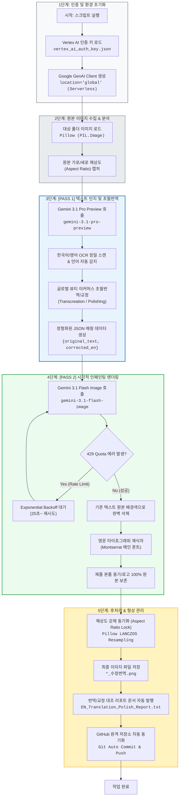

# 🇺🇸 EN_Text-In_Image_Translation_Engine_V1 동작 흐름 및 기술 스택 가이드

본 문서는 **다국어 이미지 번역 시스템 (영어 파이프라인)**에 적용된 핵심 엔진(`EN_Text-In_Image_Translation_Engine_AGY_SDK.py`)의 동작 흐름과 단계별 기술 스택(Tech Stack)을 정리한 표준 기술 문서입니다.

---

## 📊 1. 엔진 작업 동작 흐름 플로우차트 (Workflow Flowchart)

---

---

## ⚙️ 엔진 하이퍼파라미터 및 토큰 제원 (Hyperparameters & Token Limits)
- **4대 핵심 하이퍼파라미터 (GenerationConfig)**:
  - `temperature`: **0.6** (해외 광고법 준수 안전선 유지 및 럭셔리 초월번역 밸런스 확보)
  - `top_p`: **0.9** (하위 10% 투박한 직역 표현 배제 및 정제된 백화점 뷰티 어휘 필터링)
- **토큰 한도 이원화 (Token Limit Dualization)**:
  - **대용량 데이터 추출 및 고시표 번역 (Pass 1 & Table Render)**: `max_output_tokens=8192` (전성분 등 방대한 화학 명칭 및 JSON 구조 유실 방지)
  - **마케팅 카피 및 SEO 생성 (SEO/GEO/AEO)**: `max_output_tokens=4096` (불필요한 장황한 설명 차단 및 API 비용 최적화)

> 💡 **[Temperature 0.6 공학적·수학적 배경 및 실측 제원 주석]**
> - **수학적 작동 원리 (Softmax 연산식)**: $P(w_i) = \frac{\exp(z_i / T)}{\sum_j \exp(z_j / T)}$
>   - $T$ (Temperature)는 다음 단어를 샘플링할 때 확률 분포의 평탄화(Flatness) 정도를 제어하는 조절 매개변수임.
> - **실측 동작 특성 비교**:
>   - `T = 0.5`: 상위 1~2개 고확률 단어에 선택이 집중되어 결정론적/보수적 연산 수행 (문장이 딱딱한 기계 직역으로 고착됨).
>   - `T = 0.7`: 하위 확률 단어의 채택 가능성이 높아져 무작위성 및 창의성은 증가하나, 원문에 없는 과장/절대화 금지어 환각 및 광고법 위반 리스크 급증.
>   - `T = 0.6`: 해외 화장품 광고법(미국 MoCRA, 대만 TFDA, 일본 약기법, 중국 NMPA) 위반 리스크 차단과 백화점·세포라급 럭셔리 초월번역(Transcreation) 감성 품질 간의 **최적 균형점(황금 비율)**.

---

## 🛠️ 2. 단계별 적용 기술 스택 (Tech Stack Summary)

| 단계 | 주요 기능 | 적용 기술 스택 (Core Technology) | 핵심 역할 및 설명 |
| :--- | :--- | :--- | :--- |
| **0. Auth** | 클라우드 인증 | **Google Cloud Vertex AI** (`google-genai` SDK) | `location="global"` 기반의 Serverless 관리형 공식 표준 엔드포인트 연결 |
| **1. Pass 1** | 인지 및 초월번역 | **`gemini-3.1-pro-preview`** (추론 엔진) | • 다국어 OCR 정밀 스캔 • 한국어 ➔ 영문 초월번역(Transcreation) • 기존 영문 ➔ 네이티브 표현 다듬기(Polishing) • 구조화된 JSON 데이터 출력 |
| **2. Pass 2** | 이미지 재렌더링 | **`gemini-3.1-flash-image`** (생성 엔진) | • 기존 텍스트 배경색 매칭 삭제 (Seamless Inpainting) • **글로벌 프리미엄 산세리프 `Montserrat` (몬세라트) 메인 폰트 재식자** • 제품 패키지/로고 원형 보존 |
| **3. Retry** | 통신 안정성 | **Exponential Backoff Algorithm** | 429 Resource Exhausted (분당 쿼터 제한) 발생 시 25초~ 점진적 대기 후 자동 재시도 |
| **4. Post-Proc**| 해상도 보존 | **Python Pillow (LANCZOS)** | 원본 픽셀 종횡비(Aspect Ratio) 및 가로/세로 해상도 1:1 강제 일치 복원 (크롭/찌그러짐 방지) |
| **5. DevOps** | 형상 관리 | **Git / GitHub Repository (PANDORA)** | 소스코드 및 기술 문서 변경 시 원격 저장소(`main` 브랜치) 실시간 자동 커밋 및 푸시 |
| **6. Notice Spec** | 고시정보 표 렌더링 | **Headless Edge + Pretendard** | 가로 860px (컨테이너 820px) 고정, 세로 Auto-Fit (최대 2,580px 이하, 초과 시 1차 행간 유동 압축(Squeeze), 실패 시 2페이지 분할), 타이틀 60px, 본문 30px, 1열 295px 좌측 중앙정렬 및 `Cosmetics Manufacturer / Responsible Distributor`, `Functional Cosmetics Review Status` 등 영문 전용 샌드박스 개행 적용 |
| **7. SEO/AEO** | 검색 최적화 자동 생성 | **`Dynamic {product_name} Prompting`** | 타겟 폴더의 상품명(`{product_name}`)을 실시간 동적 감지 및 매핑하여, 특정 제품에 고정되지 않은 100% 맞춤형 사용법 및 5대 핵심 FAQ 자동 생성 |

---

## 💡 3. 엔진 핵심 아키텍처 및 폰트 표준화 규칙

1. **영문 표준 폰트 철저 격리 원칙 (Strict Font Isolation Rule)**:
   - **메인 이미지 및 상세페이지 텍스트**: 글로벌 이커머스 표준 지오메트릭 산세리프인 **`Montserrat (몬세라트)` 100% 단일 서체만 강제 적용**합니다. (AI 인페인팅 엔진 내 타 서체/Pretendard 혼용 절대 금지)
   - **상품상세정보(고시정보) 테이블**: 데이터 가독성 및 정렬을 위해 오직 독립 Headless HTML 모듈(`render_notice_table_standard.py`)에서만 **`Pretendard` 폰트**를 전용 분리 적용합니다.

2. **지능형 언어 자동 감지 (Auto-Detect Dual Mode)**:
   - 이미지 속 텍스트가 한글이면 자동으로 `TRANSLATE_KR_TO_EN` 모드로 동작하여 한글을 영어로 초월번역합니다.
   - 이미지 속 텍스트가 영어이면 자동으로 `POLISH_EN_TO_EN` 모드로 동작하여 어색한 콩글리시/문법 오류를 네이티브 이커머스 표현으로 다듬어 교정합니다.

3. **완전 재생성 원칙 (Full Regeneration Rule)**:
   - 오류나 수정 발생 시 국소 덧칠(Patching)을 금지하고 전체 캔버스를 처음부터 끝까지 완전하게 다시 생성하여 무결점 퀄리티를 유지합니다.

4. **상품 패키지 원본 보존 (Product Package Text & Logo Protection)**:
   - 화장품 용기, 튜브, 단상자 등에 인쇄된 원본 로고와 텍스트는 인페인팅 대상에서 제외하여 패키지 고유의 시각적 형태를 100% 보존합니다.

5. **상품 정보 고시 표 표준 렌더링 규격 (Notice Table Rendering Standard)**:
   - 가로 폭: **전체 캔버스 `860px` 고정 (내부 컨테이너 `820px`)**
   - 세로 높이: **`Auto-Fit` (최대 허용치 `2,580px` 이하, 초과 시 1차 행간 유동 압축(Squeeze), 실패 시 2페이지 자동 분할)**
   - 고시표 전용 폰트: **`Pretendard`** (Bold 700 / Regular 400)
   - 폰트 크기: **타이틀 `52px` (Bold), 항목명 `28px` (Bold), 본문 `28px` (전성분 `24px`)**
   - 1열 (라벨) 규격: **`width: 295px; padding: 10px 12px; letter-spacing: -0.8px; word-break: keep-all; overflow-wrap: break-word; text-align: left; vertical-align: middle;` (가용폭 확보, 세로 2570px 1장 수납 보장)**
   - 2열 (본문) 규격: **`word-break: keep-all; overflow-wrap: break-word; text-align: left; vertical-align: middle;` (텍스트 이탈 방지 및 좌측 중앙정렬 적용)**
   - 지능형 줄바꿈: **`Country of Origin`, `Quality Assurance Standard`, `Precautions for Use`, `Manufacturer / Distributed by` 등 영문 독립 샌드박스 대칭 개행 적용**
   - **[핵심] 영어 번역 표준 명칭 (아마존/세포라 기준 강제 매핑)**:
     - 용량/중량 ➔ `Size / Net Wt.`
     - 주요 사양 ➔ `Skin Type`
     - 기한/개봉후 ➔ `Shelf Life / Period After Opening`
     - 사용방법 ➔ `Directions`
     - 제조업자/책임판매업자 ➔ `Manufacturer / Distributed by`
     - 제조국/원산지 ➔ `Country of Origin`
     - 전성분 ➔ `Ingredients`
     - 기능성화장품 심사 ➔ `Functional Cosmetics Review Status` (본문값 초월번역: 단순 'Y' 금지, `Completed Functional Cosmetics Review (or Report) with the Ministry of Food and Drug Safety (MFDS, Republic of Korea) in accordance with the Cosmetics Act` 강제 적용)
     - 사용상 주의사항 ➔ `Precautions for Use`
     - 품질보증기준 ➔ `Quality Assurance Standard`
     - 소비자상담 ➔ `Customer Service` (+82-2-6743-3206)
   - 렌더러: `00_공통자료/render_notice_table_standard.py` 표준 모듈 사용

6. **글로벌 럭셔리 뷰티 초월번역 및 규제 준수 표준 규격 (Global Luxury Beauty Transcreation & Compliance Standard)**:
   - **페르소나**: 에스티로더, 랑콤 등 글로벌 하이엔드 코스메틱 10년 차 수석 CD 및 엘리트 카피라이터 페르소나 적용.
   - **직역 부사 금지**: `Definitely`, `Truly`, `Really`, `Certainly` 등 기계적 부사 직역 전면 금지 ➔ 능동적 럭셔리 뷰티 동사/형용사 재창조.
   - **성분 구문 결속**: "10% LiftDerm" 등 활성 성분 수치가 문맥과 끊기지 않고 제품 효능 서사로 매끄럽게 결합되도록 문장 구조화.
   - **4대 바이오 뷰티 전문 어휘 사전**:
     * 피부 속/기저층: `Deep within the skin layers / Deep within the dermal matrix`
     * 토탈 케어/멀티 코렉티브: `Multi-Corrective Repair / Total Revitalizing Care`
     * 탄력 복원/강화: `Rebuilding skin elasticity / Restoring visible firmness`
     * 눈가 잔주름/건조주름: `Fine lines and wrinkles / Micro-creases`
   - **절대적/과대 표현 전면 금지 (Ban on Absolute Claims)**: 'World's First', 'No.1', 'Best', 'The Ultimate' 등 검증 불가능한 과장 표현 전면 금지 ➔ `Innovative formula engineered for delicate eye areas`, `Advanced Multi-Corrective Solution`, `Targeted Precision Care` 등 프리미엄 혁신 표현으로 순화.
   - **의료 시술 오인 금지 및 4대 안전 동사 (Compliance-Safe Verbs)**: 보톡스/필러 등 의료 시술 연상 및 '주름 완전 박멸(Wrinkle-free)' 표현 전면 배제 ➔ 반드시 **`Smooth` (抚平/撫平)**, **`Diminish` (淡化)**, **`Alleviate` (舒缓/舒緩)**, **`Care / Repair` (修护/修護)** 4대 안전 동사 사용.
   - **세포라/백화점 톤앤매너**: 세포라(Sephora) 및 최고급 백화점 프레스티지 뷰티 톤 적용.

- 💡 **[2026-08 CSS 버그 픽스]**: 긴 단어에 의한 표 폭 팽창(이미지 우측 여백 발생 및 타이틀 좌측 쏠림 현상)을 방지하기 위해 공통적으로 `table-layout: fixed;` 속성을 강제 적용함.

---

## 🏆 초월번역(Transcreation) 품질 자동 평가 4대 루브릭 (100점 만점)
- **① 현지 카테고리 어휘 적합성 (30점)**: 콩글리시/직역투 배제, 현지 뷰티 플랫폼 네이티브 어휘 채택
- **② 국가별 광고법 무결성 (30점)**: 미국 MoCRA, 일본 약기법, 중국 NMPA/신광고법 위반 표현 100% 차단
- **③ 브랜드 감성 및 초월번역 완성도 (25점)**: 백화점·세포라급 하이엔드 뷰티 톤앤매너 및 구매 전환 설득력
- **④ 시각적 레이아웃 및 가독성 (15점)**: 텍스트 박스 침범 방지 및 간결한 문장 구조
- **[합격 기준 및 자가치유]**: **90점 이상 & 위반 0건 합격**, 미달 시 피드백 기반 **최대 2회 자동 재렌더링 및 `Transcreation_QA_Report.html` 발행**

## 4-Core 검색 최적화(SEO/GEO/AEO) 및 하이브리드 인제스천 표준
- **4-Core 표준 구조**: 1. 공식 상품명 (100자 NPO) ➔ 2. 5줄 마이크로 요약 ➔ 3. 제품 상세 비교 스펙 테이블(HTML Table) ➔ 4. 5대 핵심 FAQ
- **하이브리드 듀얼 인제스천**: `url.txt` 웹 실시간 텍스트 스크래핑 및 미출시 신제품 4중 이미지 팩트 앵커링 지원
- **트리플 익스포트**: `.docx` (MS Word), `.html` (원클릭 복사 뷰어), `.txt` (가독성 개행), `.md` 4종 파일 일괄 동시 생성
- **Zero Meta Commentary**: 내부 개발/최적화 용어 일체 배제한 100% 고객 대면용 카피
