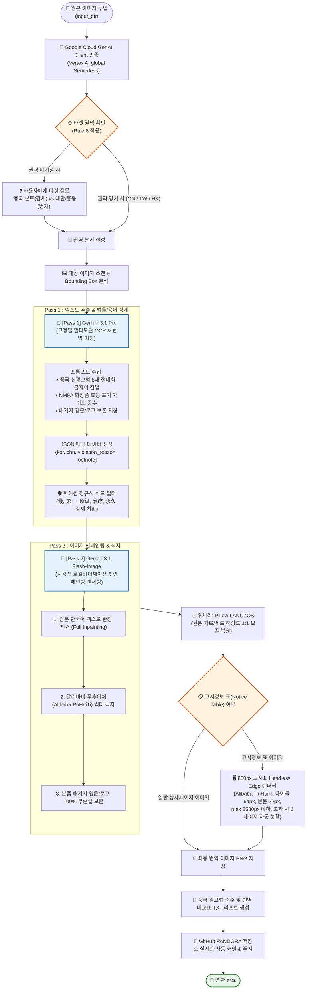

# 🇨🇳 중국어(간체/번체) 이미지 번역 엔진 개발 계획 및 아키텍처 정의서

> **엔진 명칭**: `CN_Text-In_Image_Translation_Engine_V1.py`  
> **기반 아키텍처**: Two-Pass Multimodal Neural Inpainting Architecture (Gemini 3.1 Pro + Flash-Image)  
> **지원 권역**: 중국 본토(간체자 `zh-CN`), 대만(번체자 `zh-TW`), 홍콩(번체자 `zh-HK`)  
> **표준 폰트**: 알리바바 푸후이체 (阿里巴巴普惠体 / Alibaba PuHuiTi 3.0)

---

## 📊 1. 엔진 작업 동작 흐름 플로우차트 (Workflow Diagram)

> 💡 **[아키텍처 주석]**: 본 플로우차트와 엔진(`CN_Text-In_Image_Translation_Engine_V1.py`)은 **프로토 베이직 엔진(`PROTO_Text-In_Image_Translation_Engine_V0.py`)의 Two-Pass 코어를 기반으로 중국어권(본토/대만/홍콩) 특화 번역엔진으로 개발**되었습니다.

---

## 🛠️ 2. 단계별 적용 기술 스택 (Tech Stack Summary)

| 단계 | 역할 및 목적 | 적용 기술 스택 | 세부 설명 |
| :--- | :--- | :--- | :--- |
| **1. AI Model** | OCR & 텍스트 검열 | **`gemini-3.1-pro-preview`** | 이미지 속 한글 100% 인식 및 중국 신광고법/NMPA 규제 준수 JSON 매핑 생성 |
| **2. Inpainting** | 이미지 인페인팅 식자 | **`gemini-3.1-flash-image`** | 한글 제거 후 알리바바 푸후이체로 자연스러운 무결점 인페인팅 렌더링 |
| **3. Font Engine**| 표준 타이포그래피 | **`Alibaba-PuHuiTi` (5 Weights)** | 알리바바 공식 푸후이체 3.0 (Regular, Medium, Bold, Heavy, Light) 식자 |
| **4. Legal Filter**| 광고법 자동 정제 | **`Python Regex + OpenCC`** | 중국 신광고법 절대화 금지어(`最`, `第一`, `顶级` 등) 원천 차단 및 간/번체 정규화 |
| **5. Post-Proc** | 해상도/비율 보존 | **`Pillow (PIL - LANCZOS)`** | 원본 종횡비(Aspect Ratio) 및 가로/세로 픽셀 1:1 강제 일치 복원 |
| **6. Notice Spec** | 고시정보 표 렌더링 | **`Headless Edge + Alibaba-PuHuiTi`**| 가로 `860px` 고정, 세로 `Auto-Fit` (최대 2,580px 이하, 초과 시 2페이지 분할), 타이틀 64px, 본문 32px |
| **7. DevOps** | 형상 관리 | **`Git / GitHub (PANDORA)`** | 코드 및 결과 문서 변경 시 원격 저장소(`main` 브랜치) 실시간 자동 커밋/푸시 |

---

## 💡 3. 중국어 엔진 핵심 5대 개발 특징

1. **중국 신(新) 광고법 100% 원천 차단 (Ad-Law Compliance Engine)**:
   - 중국 시장에서 벌금 및 상품 삭제 위험이 있는 8대 절대화 표현(`最`, `第一`, `顶级`, `极品`, `永久`, `彻底`, `万能`, `根除`)을 프롬프트와 파이썬 정규식 필터 이중 안전망으로 완벽 차단 및 순화(`卓越`, `优异`, `精心` 등으로 대체).

2. **3대 권역 지능형 분기 (Tri-Region Targeting)**:
   - `CN`: 중국 본토 타오바오/티몰/샤오홍슈/더우인 최적화 간체자(`zh-CN`)
   - `TW`: 대만 쇼피(Shopee TW)/momo 최적화 번체자(`zh-TW`)
   - `HK`: 홍콩 HKTVmall/Watsons HK 최적화 번체자(`zh-HK`)

3. **알리바바 푸후이체 공식 폰트 파이프라인 (Alibaba PuHuiTi 3.0)**:
   - 중화권 이커머스 표준 서체인 알리바바 푸후이체 5종 웨이트를 완벽 연동하여 벡터 텍스트의 선명도와 가독성을 보장.

4. **완전 재생성 원칙 (Full Regeneration Rule)**:
   - 부분 덧칠(Patching)을 금지하고 캔버스 전체를 완전히 새롭게 렌더링하여 1픽셀의 이질감도 없는 최상의 퀄리티 유지.

5. **상품 패키지 포장 원본 보존 (Package Logo Protection)**:
   - 화장품 용기, 튜브, 패키지 상자에 인쇄된 원본 로고와 영문 텍스트는 인페인팅 대상에서 완벽히 제외하여 제품 고유 형태 보존.
