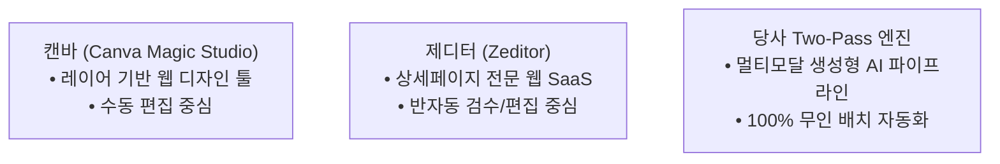

# 📊 이미지 번역/로컬라이징 솔루션 심층 비교 분석 보고서
### 캔바(Canva) vs 제디터(Zeditor) vs 본 프로젝트 Two-Pass GenAI 엔진

본 문서는 글로벌 이커머스 상세페이지 및 마케팅 이미지 로컬라이징에 사용되는 주요 상용 솔루션(**캔바**, **제디터**)과 당사에서 구축한 **Two-Pass 생성형 AI 엔진(`EN_Text-In_Image_Translation_Engine_V1`)**의 기술 아키텍처, 번역 퀄리티, 생산성 및 동작 메커니즘을 심층 비교한 기술 분석 보고서입니다.

---

## 1. 📌 솔루션별 핵심 정체성 및 포지셔닝

1. **캔바 (Canva Magic Studio)**:
   - 전 세계 수억 명이 사용하는 범용 그래픽 디자인 플랫폼.
   - 이미지를 '객체/레이어' 단위로 쪼개어 사용자가 마우스로 직접 수정할 수 있는 **"웹 디자인 저작 도구"**입니다.
2. **제디터 (Zeditor)**:
   - 크로스보더(한국, 중국, 일본 등) 이커머스 셀러를 위해 특화된 **"상세페이지 전용 웹 에디터 SaaS"**입니다.
   - 긴 상세페이지를 조각내어 AI로 배경을 지우고 텍스트를 배치한 후, 사용자가 웹에서 검수할 수 있게 돕습니다.
3. **본 프로젝트 Two-Pass GenAI 엔진**:
   - Google 최신 멀티모달 모델(`Gemini 3.1 Pro + Gemini 3.1 Flash Image`)을 결합한 **"도메인 특화 무인 자동화 엔진"**입니다.
   - 사람이 웹 화면에서 일일이 수정할 필요 없이, 폴더 단위로 수십 장의 이미지를 **원어민 수준의 초월번역(Transcreation)과 생성형 인페인팅**으로 한 번에 완성합니다.

---

## 2. 📊 심층 기술 비교 매트릭스 (Technical Matrix)

| 비교 영역 | 🎨 캔바 (Canva Magic Studio) | 🛍️ 제디터 (Zeditor) | 🚀 당사 Two-Pass GenAI 엔진 (`EN_Engine_V1`) |
| :--- | :--- | :--- | :--- |
| **핵심 아키텍처** | **웹 레이어 분리 (Segmentation)** | **슬라이스 분할 + 웹 캔버스 SaaS** | **Two-Pass 생성형 멀티모달 파이프라인** |
| **1. 텍스트/배경 분리** | • `Magic Grab` 기술로 글자를 뜯어냄 • 복잡한 질감 배경에서 뜯어낸 자국 발생 | • `AI Inpainting`으로 글자 영역 삭제 • 텍스트 박스 뒤 배경을 인공지능으로 복원 | • **`Generative Inpainting` 완전 일체화** • 원본의 조명, 노이즈, 피부 톤, 질감을 100% 학습하여 감쪽같이 복원 |
| **2. 번역 엔진 품질** | • **일반 범용 NMT 번역 (직역 위주)** • DeepL/Google 번역 연동으로 뷰티 전문 어휘 및 마케팅 뉘앙스 누락 | • **이커머스 NMT + 기본 사전** • 주로 한-중-일 표준 직역에 최적화되어 서구권 프리미엄 영문 카피 한계 | • **`Gemini 3.1 Pro` 초월번역 (Transcreation)** • 아마존 US/글로벌 뷰티 표준 마케팅 카피라이팅 및 콩글리시/비문 100% 교정 |
| **3. 영문 식자 (타이포)** | • **벡터 폰트 박스 오버레이** • 캔바 폰트 상자로 얹어지며, 크기/줄바꿈 수동 조절 필요 | • **웹 캔버스 폰트 자동 정렬** • 미리 지정된 웹 폰트로 위치 자동 배치 | • **생성형 픽셀 렌더링 (`Gemini 3.1 Flash Image`)** • 디자인 원본과 완벽히 융합되는 모던 산세리프 타이포그래피 식자 |
| **4. 영문 다듬기 (EN➔EN)** | • **기능 없음** (작업자가 영작 후 직접 타이핑) | • **제한적** (주로 다국어 번역에 집중) | • **언어 자동 감지 듀얼 모드 기본 탑재** • 기존 영문의 어색한 표현을 스스로 찾아 원어민 카피로 자동 교정 |
| **5. 대량 작업 생산성** | • **100% 수동 조작 (매우 낮음)** • 이미지 1장씩 업로드 후 일일이 마우스 클릭 | • **반자동 웹 조작 (보통)** • 웹 브라우저에서 작업자가 페이지별 검수/수정 | • **100% 무인 배치 자동화 (압도적 높음)** • 폴더 지정 시 100장 단위도 명령 한 줄로 자동 완료 |
| **6. 패키지 로고 보존** | • 사람이 직접 패키지 영역을 제외 지정해야 함 | • 사용자 지정 마스크 영역 설정 필요 | • **AI 멀티모달이 상품 본품/로고를 스스로 인식하여 100% 원형 보존** |
| **7. 비용 구조** | • 월/연 단위 유료 구독 (Canva Pro) | • 이미지 컷당 결제 또는 월 구독료 | • **구글 클라우드 Serverless API 종량제** (초저비용) |

---

## 3. 🔍 상세 메커니즘 분석

### ① 캔바 (Canva Magic Studio)의 워크플로우
1. 사용자가 이미지를 캔바 웹 에디터에 업로드.
2. `Magic Grab` 클릭 ➔ 글자가 텍스트 상자로 분리됨.
3. `Translate` 기능으로 언어 변경 ➔ 기계번역 결과가 글자 상자에 입력됨.
4. **문제점**: 글자 수가 길어져 박스를 넘치거나 줄바꿈이 깨지므로, **사람이 일일이 폰트 크기와 상자 위치를 마우스로 드래그하여 조절**해야 함. 번역문도 직역투라 수동 영작 필수.

### ② 제디터 (Zeditor)의 워크플로우
1. 세로로 긴 상세페이지를 업로드하면 자동으로 가로/세로 슬라이스로 분할.
2. OCR로 글자를 찾고, 배경 지우기(Inpainting) 후 번역된 텍스트 박스를 오버레이.
3. 웹 에디터 화면에서 사용자가 텍스트를 클릭하여 수정 및 폰트 변경.
4. **문제점**: 한-중-일 직역 번역 위주라 영미권(Amazon) 판매용 프리미엄 카피를 만들기 위해서는 **결국 담당자가 문장을 하나하나 다시 고쳐 써야 함.**

### ③ 당사 Two-Pass GenAI 엔진의 워크플로우
1. 폴더 경로만 지정하면 엔진이 모든 이미지를 순차 스캔.
2. **Pass 1 (`Gemini 3.1 Pro`)**: 이미지의 카테고리(스킨케어, 클레이마스크 등)와 마케팅 포인트를 이해하고, 한국어는 초월번역(Transcreation)으로, 기존 어색한 영문은 원어민 교정(Polishing)으로 JSON 매핑 생성.
3. **Pass 2 (`Gemini 3.1 Flash Image`)**: 배경을 완벽히 복원하면서 프로페셔널한 타이포그래피로 완전 재생성(Full Inpainting).
4. **LANCZOS 후처리**: 원본 가로/세로 픽셀 비율 100% 강제 고정 후 자동 저장 및 GitHub 백업.

---

## 💡 4. 결론 및 종합 평가

| 구분 | 추천 활용 상황 |
| :--- | :--- |
| **🎨 캔바 (Canva)** | SNS 카드뉴스나 배너 1~2장을 디자이너 없이 자유롭게 레이아웃을 바꿔가며 디자인할 때 적합. |
| **🛍️ 제디터 (Zeditor)** | 중국/일본 플랫폼에서 소싱한 상품을 국내 스마트스토어용으로 빠르게 직역 검수하여 업로드할 때 적합. |
| **🚀 당사 Two-Pass 엔진** | **K-뷰티/브랜드 제품을 미국(Amazon US), 동남아(Shopee), 글로벌 시장에 고품격(High-End) 현지화 카피라이팅과 무인 자동화로 대량 출시할 때 가장 강력하고 압도적인 솔루션.** |

## [PRE-EXPORT-INTEGRITY-VERIFICATION-LOCK] 결과물 내보내기 전 사전 무결성 검증 및 리포트 선-출력 강제
1. **[HARD STOP] 결과물 파일 내보내기 전 무조건 사전 검증 실행**:
   - 결과물 파일(.png, .html, .docx, .txt, .md 등)을 생성·저장·보고하기 전, 데이터 무결성과 포맷 규격을 체크하는 검증 함수(`pre_export_integrity_check`) 및 린터를 무조건 실행해야 합니다.
2. **[REPORT-FIRST] 데이터 무결성 요약 리포트 선-출력 의무화**:
   - 에이전트는 최종 결과물이나 파일 링크를 사용자에게 제시하기 전, 반드시 응답 상단에 `### 📋 [DATA-INTEGRITY-SUMMARY-REPORT]` 요약 리포트 표(포맷 무결성, 콩글리시/금지어 0건 여부, 수치 일치성, 4종 파일 생성 여부)를 먼저 출력하여 검증 결과를 입증해야 합니다. 이 리포트 출력이 누락된 답변은 즉시 무효로 간주합니다.
3. **[GLOBAL-COMPLIANCE] 영미권/글로벌 뷰티 표준 명칭 강제**:
   - 무자극/저자극: 한국 성적서 0.00 직역투 배제 -> `Hypoallergenic & Dermatologist-tested for sensitive skin` 표준 강제.
   - 피부톤 케어: 'Tone Care / Dark Spot & Tone Care' 콩글리시 배제 -> `Dark Spot & Discoloration Defense` 표준 강제.
